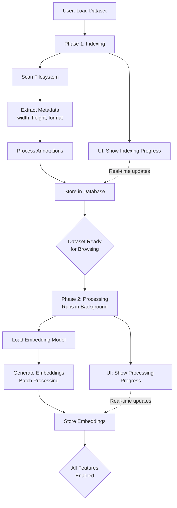

# Scalable Dataset Loading: Two-Phase Architecture

## Problem
Loading large datasets was blocking and slow:
- 10,000 images took 60-180 seconds with no feedback
- Users had to wait for everything (metadata + embeddings) to complete
- No progress indication during loading
- Application startup was blocked by dataset loading

## Solution: Split into Two Independent Phases

### Phase 1: Indexing (Metadata)
- Scan filesystem and extract image metadata
- Calculate dimensions (width/height)
- Process annotations if provided
- Store samples in database
- **Result:** Dataset is browsable immediately

### Phase 2: Processing (Embeddings)
- Generate ML embeddings in background
- Batch processing for GPU efficiency
- Can be done asynchronously
- **Result:** Enable embedding-based features when complete

**Key Improvement:** Both indexing and processing are now **completely separated from application startup**. The application starts immediately, and datasets can be loaded on-demand without blocking the UI.

## Architecture Diagram

## Benefits

| Aspect | Before | After |
|--------|--------|-------|
| **Application Startup** | Blocked by dataset loading | Instant startup |
| **Initial Load** | 60-180s blocking | Immediate browsing |
| **User Feedback** | No progress indication | Clear phase separation |
| **Usability** | Wait for everything | Use dataset while processing |
| **Parallelization** | Sequential operations | Independent phases |

## Impact

✅ **Instant Application Startup:** App starts immediately without waiting for any dataset operations

✅ **Faster Time-to-Value:** Users can browse and explore datasets immediately after indexing

✅ **Better UX:** Clear separation between "dataset ready" vs "embeddings ready"

✅ **Resource Optimization:** Embeddings can be processed during off-peak hours

✅ **Flexibility:** Can skip embedding generation entirely if not needed

✅ **Non-blocking Operations:** All dataset operations happen independently from application lifecycle