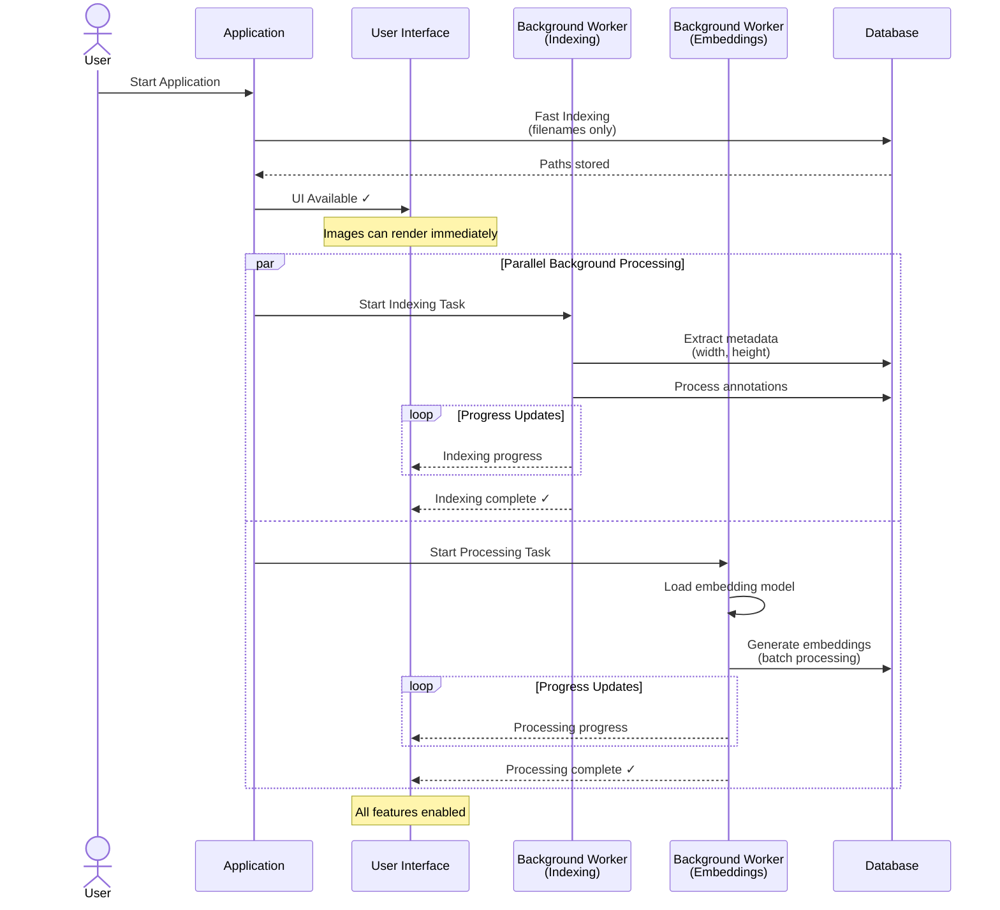

# Scalable Dataset Loading: Three-Step Architecture

## Problem
Loading large datasets was blocking and slow:
- 10,000 images took 60-180 seconds with no feedback
- Users had to wait for everything (metadata + embeddings) to complete
- No progress indication during loading
- Application startup was blocked by dataset loading

## Solution: Fast Startup with Background Processing

### Step 1: Fast Indexing (Immediate)
- Scan filesystem for filenames only
- Store file paths in database
- **Result:** UI becomes available immediately, images can render

### Step 2: Indexing with Metadata (Background Task)
- Extract image metadata (width, height, format)
- Process annotations if provided
- Store complete metadata in database
- **Result:** Dataset is fully indexed and browsable

### Step 3: Processing Embeddings (Background Task)
- Load embedding model
- Generate ML embeddings in batches
- Store embeddings for similarity search
- **Result:** All features enabled (similarity search, clustering, etc.)

**Key Improvement:** Application starts immediately with fast filename indexing. UI is accessible while metadata extraction and embedding calculation run in the background. Users see real-time progress for all background tasks.

## Architecture Diagram

## Benefits

| Aspect | Before | After |
|--------|--------|-------|
| **Application Startup** | Blocked by dataset loading | Instant startup |
| **UI Availability** | Wait 60-180s | Immediate (<1s) |
| **User Feedback** | No progress indication | Real-time progress tracking |
| **Usability** | Wait for everything | Use dataset while processing |
| **Parallelization** | Sequential operations | Independent background tasks |

## Impact

✅ **Instant Application Startup:** App starts in <1 second with fast filename indexing

✅ **UI Available Immediately:** Users can see and interact with images right away

✅ **Real-Time Progress Tracking:** UI shows progress for all background tasks

✅ **Better UX:** Clear separation between "UI ready" → "indexed" → "embeddings ready"

✅ **Resource Optimization:** Heavy operations (metadata, embeddings) happen in background

✅ **Non-blocking Operations:** All heavy processing separated from application lifecycle
