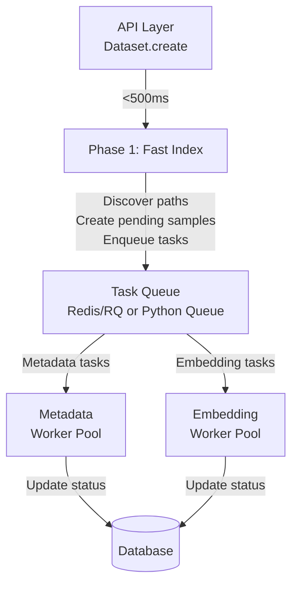
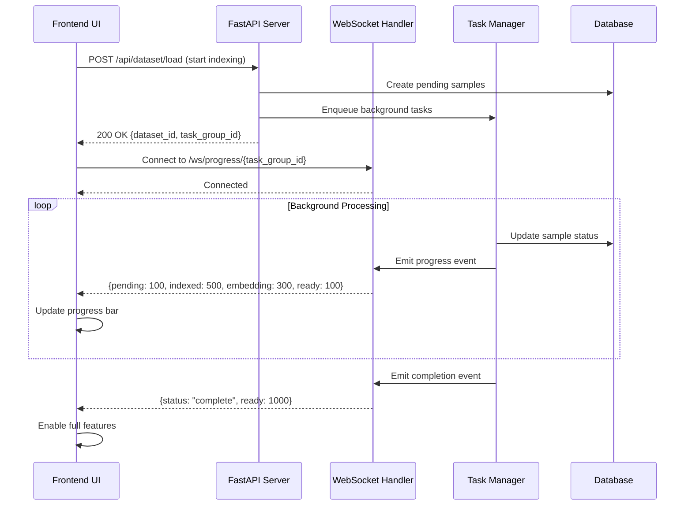
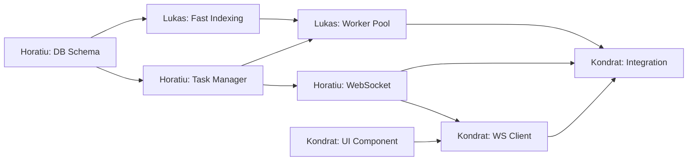

# Architecture Proposal: Scalable Dataset Indexing

## Current Bottlenecks

Based on analysis of the codebase, the following bottlenecks exist in dataset indexing:

1. **Filesystem I/O**: Sequential file discovery and metadata extraction (PIL.Image.open for dimensions) in [add_samples.py:88-99](src/lightly_studio/core/add_samples.py#L88-L99)
2. **Database operations**: Batch inserts in chunks of 32 samples ([add_samples.py:50](src/lightly_studio/core/add_samples.py#L50))
3. **Embedding calculation**: Synchronous, happens after all samples are added ([dataset.py:366-369](src/lightly_studio/core/dataset.py#L366-L369), [dataset.py:524-527](src/lightly_studio/core/dataset.py#L524-L527))
4. **Annotation processing**: Happens inline with sample creation ([add_samples.py:180-186](src/lightly_studio/core/add_samples.py#L180-L186))

## Proposed Architecture: Three-Phase Loading

### Goal
- Initial fast indexation: **<500ms**
- Background task assignment for heavy operations
- UI starts immediately with progress indication

### Phase 1: Fast Indexing (<500ms)
Create a "pending" dataset state with minimal metadata:
- Quick filesystem scan (paths only, no image opening)
- Create sample records with `status="pending"`
- Store basic info: `file_path_abs`, `file_name`
- Skip width/height extraction (defer to Phase 2)
- Return control to UI immediately

### Phase 2: Background Metadata Extraction
Async worker pool extracts full metadata:
- Image dimensions (width/height) via PIL
- Annotation processing if provided
- Update sample records with full metadata
- Update status to `status="indexed"`

### Phase 3: Background Embedding Calculation
Separate worker queue for embedding generation:
- Batch processing (can be parallelized)
- Progress tracking via status field
- Update status to `status="ready"`
- Enable embedding-based features once complete

## Recommended Pattern: Producer-Consumer with Work Queue



## Implementation Options

### Option A: asyncio + Queue (Simplest) ⭐ RECOMMENDED
**Pros:**
- No external dependencies (Redis)
- Fast to implement
- Built-in to Python
- Can later migrate to Celery if needed
- Works well with existing tqdm progress bars

**Cons:**
- Limited to single machine
- No built-in persistence (tasks lost on restart)

**Use case:** Single-machine deployment, quick iteration

### Option B: Celery/RQ (Production-Ready)
**Pros:**
- Redis-backed task queue with persistence
- Built-in retry, monitoring, progress tracking
- Scales across multiple workers/machines
- Production-grade reliability

**Cons:**
- Requires Redis dependency
- More complex setup
- Heavier infrastructure

**Use case:** Multi-machine deployment, high reliability requirements

### Option C: FastAPI BackgroundTasks (Lightweight)
**Pros:**
- Built into FastAPI
- Zero additional dependencies
- Simple API

**Cons:**
- No persistence
- Limited monitoring/retry capabilities
- Not suitable for long-running tasks

**Use case:** Very light workloads only

## Recommended Changes to Code Structure

### 1. Add Sample Status Field

Modify the sample model to track processing state:

```python
# In models/sample.py or models/image.py
class SampleTable(SQLModel, table=True):
    # ... existing fields ...
    status: Literal["pending", "indexed", "embedding", "ready"] = "pending"
```

### 2. Split `add_samples_from_coco` into Phases

**Current flow:** (synchronous, blocking)
```python
dataset.add_samples_from_coco(
    annotations_json=annotations_json,
    images_path=images_path,
)
# Returns only when everything is complete (slow!)
```

**Proposed flow:** (async, non-blocking)
```python
# Phase 1: Fast indexing (returns immediately)
def add_samples_from_coco_fast(self, ...) -> tuple[list[UUID], TaskGroup]:
    """Fast path: enumerate files and create pending samples."""
    # Quick filesystem scan
    image_paths = self._discover_paths(images_path)

    # Create pending samples WITHOUT opening images
    sample_ids = self._create_pending_samples(image_paths)

    # Enqueue background tasks
    tasks = TaskManager.enqueue_metadata_tasks(
        sample_ids=sample_ids,
        annotations_json=annotations_json,
        images_path=images_path,
    )

    return sample_ids, tasks

# Phase 2: Background metadata extraction
async def _process_metadata_task(sample_id: UUID, image_path: Path, annotations: dict):
    """Extract image dimensions and process annotations."""
    # Open image to get dimensions
    with fsspec.open(image_path, "rb") as file:
        image = PIL.Image.open(file)
        width, height = image.size

    # Update sample record
    image_resolver.update_dimensions(sample_id, width, height)

    # Process annotations if available
    if annotations:
        _process_annotations(sample_id, annotations)

    # Update status
    sample_resolver.update_status(sample_id, "indexed")

# Phase 3: Background embedding calculation
async def _process_embedding_task(sample_ids: list[UUID], dataset_id: UUID):
    """Generate embeddings in batches."""
    embedding_manager = EmbeddingManagerProvider.get_embedding_manager()
    model_id = embedding_manager.load_or_get_default_model(session, dataset_id)

    # Update status to show embedding in progress
    sample_resolver.update_status_many(sample_ids, "embedding")

    # Generate embeddings
    embedding_manager.embed_images(session, dataset_id, sample_ids, model_id)

    # Mark complete
    sample_resolver.update_status_many(sample_ids, "ready")
```

### 3. Add Progress Tracking API

Expose progress information for the UI:

```python
class Dataset:
    def get_loading_progress(self) -> dict[str, int]:
        """Get current loading progress breakdown by status."""
        return {
            "total": sample_resolver.count_by_dataset_id(self.session, self.dataset_id),
            "pending": sample_resolver.count_by_status(self.session, self.dataset_id, "pending"),
            "indexed": sample_resolver.count_by_status(self.session, self.dataset_id, "indexed"),
            "embedding": sample_resolver.count_by_status(self.session, self.dataset_id, "embedding"),
            "ready": sample_resolver.count_by_status(self.session, self.dataset_id, "ready"),
        }

    def is_ready(self) -> bool:
        """Check if all samples are fully processed."""
        progress = self.get_loading_progress()
        return progress["ready"] == progress["total"]
```

### 4. New Task Manager Module

Create `src/lightly_studio/core/task_manager.py`:

```python
"""Task manager for background processing."""

import asyncio
from dataclasses import dataclass
from typing import Callable
from uuid import UUID

@dataclass
class TaskGroup:
    """Represents a group of related tasks."""
    task_ids: list[str]
    total_count: int

    async def wait(self):
        """Wait for all tasks to complete."""
        pass

    def get_progress(self) -> dict[str, int]:
        """Get progress information."""
        pass

class TaskManager:
    """Manages background task execution."""

    _metadata_queue: asyncio.Queue = asyncio.Queue()
    _embedding_queue: asyncio.Queue = asyncio.Queue()
    _workers_started: bool = False

    @classmethod
    def start_workers(cls, n_metadata_workers: int = 4, n_embedding_workers: int = 2):
        """Start background worker pools."""
        if cls._workers_started:
            return

        # Start metadata workers
        for _ in range(n_metadata_workers):
            asyncio.create_task(cls._metadata_worker())

        # Start embedding workers
        for _ in range(n_embedding_workers):
            asyncio.create_task(cls._embedding_worker())

        cls._workers_started = True

    @classmethod
    async def _metadata_worker(cls):
        """Worker that processes metadata extraction tasks."""
        while True:
            task = await cls._metadata_queue.get()
            try:
                await task()
            finally:
                cls._metadata_queue.task_done()

    @classmethod
    async def _embedding_worker(cls):
        """Worker that processes embedding generation tasks."""
        while True:
            task = await cls._embedding_queue.get()
            try:
                await task()
            finally:
                cls._embedding_queue.task_done()

    @classmethod
    def enqueue_metadata_tasks(cls, sample_ids: list[UUID], ...) -> TaskGroup:
        """Enqueue metadata extraction tasks."""
        task_ids = []
        for sample_id in sample_ids:
            task_id = cls._metadata_queue.put_nowait(
                lambda: _process_metadata_task(sample_id, ...)
            )
            task_ids.append(task_id)

        return TaskGroup(task_ids=task_ids, total_count=len(sample_ids))
```

## Key Files to Modify

1. **[dataset.py](src/lightly_studio/core/dataset.py)**
   - Add async versions of `add_samples_from_coco`, `add_images_from_path`, etc.
   - Add `get_loading_progress()` and `is_ready()` methods
   - Split embedding generation to separate phase

2. **[add_samples.py](src/lightly_studio/core/add_samples.py)**
   - Create `load_into_dataset_from_paths_fast()` that skips PIL.Image.open
   - Make metadata extraction async
   - Add status field updates

3. **[embedding_manager.py](src/lightly_studio/dataset/embedding_manager.py)**
   - Add batch queueing support
   - Add progress callbacks

4. **New file: `task_manager.py`**
   - Implement TaskManager class
   - Handle work queue coordination
   - Provide progress tracking

5. **[models/sample.py](src/lightly_studio/models/sample.py)** or **[models/image.py](src/lightly_studio/models/image.py)**
   - Add `status` field to track processing state

## Migration Path

### Step 1: Add Status Field
- Add `status` field to sample models
- Default to "ready" for backward compatibility
- Migrate existing samples to "ready" status

### Step 2: Implement Fast Indexing
- Create `_fast` variants of loading methods
- Skip dimension extraction in Phase 1
- Store paths only

### Step 3: Add Task Manager
- Implement asyncio-based task queue
- Add metadata worker pool
- Add embedding worker pool

### Step 4: Add Progress API
- Implement `get_loading_progress()`
- Add status query methods to resolvers
- Expose progress to UI

### Step 5: Update UI
- Show loading progress indicator
- Enable partial dataset viewing
- Disable embedding features until ready

## Performance Expectations

### Before (Current)
- 10,000 images from COCO: **~60-180 seconds**
  - File discovery: ~2s
  - Image opening (dimensions): ~20-40s
  - Database inserts: ~5-10s
  - Embeddings: ~30-120s

### After (Proposed)
- Initial response: **<500ms**
  - File discovery only: ~2s → ~200ms (lazy iterator)
  - Database inserts (pending): ~200ms
- Background completion: **~60-180 seconds** (same total time)
- **UI available immediately** with progress indication

## Additional Optimizations

### Parallel Filesystem Scanning
Use `concurrent.futures` to scan directories in parallel:
```python
from concurrent.futures import ThreadPoolExecutor

def discover_paths_parallel(root_path: Path) -> Iterator[Path]:
    with ThreadPoolExecutor(max_workers=8) as executor:
        # Scan subdirectories in parallel
        pass
```

### Lazy Image Dimension Extraction
For formats that store dimensions in headers (JPEG, PNG), extract without full decode:
```python
from PIL import Image

def get_image_dimensions_fast(path: str) -> tuple[int, int]:
    """Get dimensions without loading full image data."""
    with fsspec.open(path, "rb") as f:
        img = Image.open(f)
        dimensions = img.size
        img.close()  # Don't decode pixels
    return dimensions
```

### Batch Embedding with GPU Optimization
Process embeddings in larger batches for GPU efficiency:
```python
# Current: batch_size=32 (for DB inserts)
# Optimal for embeddings: batch_size=128-512 (for GPU throughput)

def embed_images_optimized(self, sample_ids: list[UUID], batch_size: int = 256):
    for i in range(0, len(sample_ids), batch_size):
        batch = sample_ids[i:i+batch_size]
        # Process larger batches for GPU efficiency
```

## Frontend Progress Tracking

### Recommended Approach: WebSocket for Real-Time Updates

Since the application uses FastAPI (confirmed in [app.py](src/lightly_studio/api/app.py)), WebSockets are the best solution for real-time progress updates.



### Implementation Options

#### Option 1: WebSocket (Real-time) ⭐ RECOMMENDED

**Pros:**
- Real-time bidirectional communication
- Native FastAPI support (`fastapi.WebSocket`)
- Efficient for frequent updates
- Can push updates from server
- Works well with asyncio task queue

**Cons:**
- Requires connection management
- May need reconnection logic
- Slightly more complex client code

**Example Implementation:**

```python
# In src/lightly_studio/api/routes/api/progress.py
from fastapi import APIRouter, WebSocket, WebSocketDisconnect
from typing import Dict
import asyncio

progress_router = APIRouter()

class ConnectionManager:
    """Manages WebSocket connections for progress updates."""

    def __init__(self):
        self.active_connections: Dict[str, list[WebSocket]] = {}

    async def connect(self, task_group_id: str, websocket: WebSocket):
        await websocket.accept()
        if task_group_id not in self.active_connections:
            self.active_connections[task_group_id] = []
        self.active_connections[task_group_id].append(websocket)

    def disconnect(self, task_group_id: str, websocket: WebSocket):
        self.active_connections[task_group_id].remove(websocket)

    async def broadcast_progress(self, task_group_id: str, progress: dict):
        """Broadcast progress to all connected clients for this task group."""
        if task_group_id in self.active_connections:
            for connection in self.active_connections[task_group_id]:
                await connection.send_json(progress)

manager = ConnectionManager()

@progress_router.websocket("/ws/progress/{task_group_id}")
async def websocket_progress(websocket: WebSocket, task_group_id: str):
    """WebSocket endpoint for real-time progress updates."""
    await manager.connect(task_group_id, websocket)
    try:
        # Keep connection alive and send updates
        while True:
            # Get current progress from database
            progress = get_task_group_progress(task_group_id)
            await websocket.send_json(progress)

            # Check if complete
            if progress.get("status") == "complete":
                break

            await asyncio.sleep(0.5)  # Update every 500ms
    except WebSocketDisconnect:
        manager.disconnect(task_group_id, websocket)
```

**Frontend (React/Svelte example):**

```typescript
// Connect to progress WebSocket
const ws = new WebSocket(`ws://localhost:8000/ws/progress/${taskGroupId}`);

ws.onmessage = (event) => {
  const progress = JSON.parse(event.data);
  updateProgressBar(progress);

  if (progress.status === 'complete') {
    ws.close();
    enableFeatures();
  }
};

ws.onerror = (error) => {
  console.error('WebSocket error:', error);
  // Fall back to polling
};
```

#### Option 2: Server-Sent Events (SSE) (One-way)

**Pros:**
- Simpler than WebSocket (HTTP-based)
- Built-in reconnection in browsers
- Native FastAPI support via `StreamingResponse`
- Good for one-way server → client updates

**Cons:**
- One-way only (server to client)
- Less efficient than WebSocket for high-frequency updates
- Limited browser connection pool (6 per domain)

**Example:**

```python
from fastapi import APIRouter
from fastapi.responses import StreamingResponse
import asyncio

@progress_router.get("/sse/progress/{task_group_id}")
async def sse_progress(task_group_id: str):
    """Server-Sent Events endpoint for progress updates."""
    async def event_generator():
        while True:
            progress = get_task_group_progress(task_group_id)
            yield f"data: {json.dumps(progress)}\n\n"

            if progress.get("status") == "complete":
                break

            await asyncio.sleep(0.5)

    return StreamingResponse(
        event_generator(),
        media_type="text/event-stream",
        headers={
            "Cache-Control": "no-cache",
            "Connection": "keep-alive",
        }
    )
```

#### Option 3: HTTP Polling (Fallback)

**Pros:**
- Simplest implementation
- Works everywhere (no special protocols)
- Easy to debug
- Good fallback option

**Cons:**
- Higher latency (polling interval)
- More server load (repeated requests)
- Less efficient than push-based approaches

**Example:**

```python
@progress_router.get("/api/progress/{task_group_id}")
async def get_progress(task_group_id: str, session: SessionDep):
    """Polling endpoint for progress updates."""
    return {
        "task_group_id": task_group_id,
        "total": 1000,
        "pending": 100,
        "indexed": 500,
        "embedding": 300,
        "ready": 100,
        "status": "in_progress"  # or "complete"
    }
```

**Frontend:**

```typescript
// Poll every 1 second
const pollProgress = async (taskGroupId: string) => {
  const interval = setInterval(async () => {
    const response = await fetch(`/api/progress/${taskGroupId}`);
    const progress = await response.json();

    updateProgressBar(progress);

    if (progress.status === 'complete') {
      clearInterval(interval);
      enableFeatures();
    }
  }, 1000);
};
```

### Recommended Architecture

**Use a hybrid approach:**

1. **Primary:** WebSocket for real-time updates
2. **Fallback:** HTTP polling if WebSocket fails
3. **Optional:** SSE as middle ground

### Integration with Task Manager

The `TaskManager` should emit progress events that the WebSocket handler can broadcast:

```python
# In task_manager.py
class TaskManager:
    _progress_callbacks: Dict[str, Callable] = {}

    @classmethod
    def register_progress_callback(cls, task_group_id: str, callback: Callable):
        """Register a callback for progress updates."""
        cls._progress_callbacks[task_group_id] = callback

    @classmethod
    async def _notify_progress(cls, task_group_id: str):
        """Notify all listeners about progress update."""
        if task_group_id in cls._progress_callbacks:
            progress = cls._get_task_group_progress(task_group_id)
            await cls._progress_callbacks[task_group_id](progress)

    @classmethod
    async def _metadata_worker(cls):
        """Worker that processes metadata extraction tasks."""
        while True:
            task_group_id, task = await cls._metadata_queue.get()
            try:
                await task()
                await cls._notify_progress(task_group_id)  # Notify after each task
            finally:
                cls._metadata_queue.task_done()
```

### Summary

**For this application, use WebSocket** because:
- ✅ FastAPI has excellent WebSocket support
- ✅ Real-time updates enhance UX significantly
- ✅ Integrates well with asyncio-based task queue
- ✅ Can push updates immediately when status changes
- ✅ Efficient for long-running operations (embedding calculation)

Implement HTTP polling as a fallback for environments where WebSocket connections are problematic.

## Hackathon Implementation Plan

### Team Composition
- **Kondrat**: Fullstack, frontend person familiar with UI part and Python code
- **Horatiu**: Fullstack, more focused on Python and architecture
- **Lukas**: Backend developer with compiled languages (C++/Rust), less familiar with codebase

### Timeline & Task Distribution

```mermaid
gantt
    title Hackathon Timeline (5 hours)
    dateFormat HH:mm
    axisFormat %H:%M

    section Kondrat (Frontend/UI)
    UI Progress Component: k1, 09:00, 90m
    WebSocket Client: k2, after k1, 90m
    Integration & Polish: k3, after k2, 120m

    section Horatiu (Python/Architecture)
    Add Status Field: h1, 09:00, 45m
    Task Manager Core: h2, after h1, 120m
    WebSocket Backend: h3, after h2, 90m
    Testing & Integration: h4, after h3, 45m

    section Lukas (Backend/Systems)
    Fast Indexing: l1, 09:00, 90m
    Worker Pool: l2, after l1, 120m
    Testing & Optimization: l3, after l2, 90m
```



### 👨‍💻 Kondrat (Frontend Focus)
**Goal:** Build the UI progress tracking system

#### Hour 1-1.5: UI Progress Component ⏱️ 90min
- Create progress bar/indicator component
- Design loading states (pending, indexed, embedding, ready)
- Mock the progress API first (fake data)
- Get visual feedback working
- **Files to create/modify:**
  - `lightly_studio_view/src/components/ProgressBar.svelte` (or similar)
  - `lightly_studio_view/src/stores/datasetProgress.ts`

#### Hour 1.5-3: WebSocket Client ⏱️ 90min
- Implement WebSocket connection logic
- Handle connection/disconnection/errors
- Add HTTP polling fallback (simpler, prioritize this!)
- Wire up to progress component
- **Files to create/modify:**
  - `lightly_studio_view/src/lib/websocket.ts`
  - `lightly_studio_view/src/lib/api/progress.ts`

#### Hour 3-5: Integration & Polish ⏱️ 2h
- Connect to real backend (once Horatiu finishes)
- Add error handling and edge cases
- Polish UX (animations, messages)
- Test with real datasets

**Deliverable:** Working UI that shows real-time progress

---

### 🏗️ Horatiu (Architecture & Python Backend)
**Goal:** Build the core infrastructure (Task Manager + Progress API)

#### Hour 1 (45min): Database Schema
- Add `status` field to `ImageTable`/`SampleTable`
- **Skip migration for now** - default to "ready" for backward compatibility
- Add resolver methods: `count_by_status()`, `update_status()`
- **Files to modify:**
  - `lightly_studio/src/lightly_studio/models/image.py`
  - `lightly_studio/src/lightly_studio/models/sample.py`
  - `lightly_studio/src/lightly_studio/resolvers/image_resolver.py`
  - `lightly_studio/src/lightly_studio/resolvers/sample_resolver.py`

#### Hour 1-3 (2h): Task Manager Core
- Create `src/lightly_studio/core/task_manager.py`
- **Simple approach:** Use threading instead of asyncio (faster to implement)
- Add worker pools (metadata only, skip embeddings for MVP)
- Implement progress tracking in database
- **Files to create:**
  - `lightly_studio/src/lightly_studio/core/task_manager.py`
- **Files to modify:**
  - `lightly_studio/src/lightly_studio/core/dataset.py` (integrate task manager)

#### Hour 3-4.5 (90min): Progress API Backend
- Create `src/lightly_studio/api/routes/api/progress.py`
- **Start with HTTP polling only** (skip WebSocket for MVP)
- Implement `GET /api/progress/{dataset_id}` endpoint
- Connect Task Manager to progress tracking
- **Files to create:**
  - `lightly_studio/src/lightly_studio/api/routes/api/progress.py`
- **Files to modify:**
  - `lightly_studio/src/lightly_studio/api/app.py` (add progress router)

#### Hour 4.5-5 (45min): Testing & Integration
- Test with Kondrat's frontend
- Debug issues, fix edge cases
- Help Lukas integrate fast indexing

**Deliverable:** Working backend with HTTP polling progress API

---

### 🚀 Lukas (Performance & Workers)
**Goal:** Optimize the bottlenecks (fast indexing + parallel workers)

#### Hour 1-1.5 (90min): Fast Indexing Implementation
- Modify `load_into_dataset_from_paths()` in `add_samples.py`
- Create `load_into_dataset_from_paths_fast()` that:
  - Skips PIL.Image.open (no dimension extraction)
  - Creates samples with `status="pending"` and `width=0, height=0` as placeholder
  - Returns immediately
- Keep it simple - just enumerate paths and insert to DB
- **Files to modify:**
  - `lightly_studio/src/lightly_studio/core/add_samples.py`
  - `lightly_studio/src/lightly_studio/core/dataset.py` (add fast methods)

#### Hour 1.5-3.5 (2h): Worker Pool Implementation
- Implement metadata extraction worker
- Use `ThreadPoolExecutor` for parallel file I/O (4-8 workers)
- Process batches of images in parallel
- Update sample status as they complete
- **Work closely with Horatiu on task_manager.py**
- **Files to modify:**
  - `lightly_studio/src/lightly_studio/core/task_manager.py` (pair with Horatiu)
  - `lightly_studio/src/lightly_studio/core/add_samples.py`

#### Hour 3.5-5 (90min): Performance Testing & Optimization
- Test with datasets (500-1000 images)
- Measure actual performance improvements
- Optimize batch sizes and worker counts
- Create simple benchmark script to show before/after
- **Create test scripts:**
  - `lightly_studio/benchmarks/test_fast_indexing.py`

**Deliverable:** Fast initial load (<500ms) + parallel background processing

---

## Integration Points & Sync Schedule

### 🔄 Sync Points (Critical for coordination)

**10:00 - Quick Standup (10 min)**
- Horatiu: Show schema changes
- Everyone: Align on status field values
- Confirm API contracts (progress endpoint format)

**11:30 - Integration Check #1 (20 min)**
- Horatiu: Task Manager basics working
- Lukas: Fast indexing prototype ready
- Kondrat: UI mockup with fake data
- **Goal:** Wire Lukas's fast indexing to Horatiu's Task Manager

**13:00 - Integration Check #2 (30 min)**
- Horatiu: Progress API endpoint ready
- Kondrat: HTTP polling client ready
- **Goal:** Connect frontend to backend, see real progress!

**14:00 - Demo Prep (30 min)**
- All three: Final polish and bug fixes
- Prepare demo dataset (500 images)
- Practice demo flow
- Prepare talking points

---

## Work Dependencies



## Success Metrics (Demo Goals)

By end of hackathon, demonstrate:

1. ✅ **Fast initial load**: Dataset starts loading in <500ms
2. ✅ **Real-time progress**: UI shows live progress updates
3. ✅ **Working background tasks**: Metadata extraction happens in background
4. ✅ **Status visualization**: Clear indication of pending/indexed/embedding/ready states
5. ✅ **Comparison demo**: Show before/after with stopwatch

## Demo Script (5 minutes)

1. **Before (Current):** Load 1000 images → wait 60 seconds, nothing happens, then everything appears
2. **After (New):** Load 1000 images → UI appears in <1 second, progress bar shows, samples appear gradually
3. **Show:** Real-time WebSocket updates in browser DevTools Network tab
4. **Explain:** Three-phase architecture diagram (Fast Index → Metadata → Embeddings)
5. **Metrics:** Show actual timing comparison

## Risk Mitigation

### If Behind Schedule

**Already simplified for 5h timeline:**
- ✅ Using HTTP polling instead of WebSocket
- ✅ Skipping embeddings worker (Phase 3) - focus on Phase 1 & 2 only
- ✅ Using threading instead of asyncio
- ✅ Images only (skip video support)

**Additional cuts if needed:**
1. **Skip parallel workers** - just do sequential background processing
2. **Skip fast indexing** - focus only on progress tracking
3. **Use fake progress** - hardcoded increments instead of real DB status

### Minimum Viable Demo (Must Have)
- Fast initial response (<500ms) - UI appears immediately
- Progress bar showing sample count increasing (polling every 1s)
- Working end-to-end with HTTP polling
- Clear visual improvement: stopwatch comparison before/after

### Blockers & Solutions

| Blocker | Solution |
|---------|----------|
| Task Manager threading complexity | Use simple queue.Queue with Thread workers |
| Database migration problems | Default status="ready", only new samples are "pending" |
| Frontend integration delays | Kondrat uses mock data until backend ready |
| Performance not meeting goals | Demo with smaller dataset (300-500 images) |
| Progress API not ready | Frontend shows fake incrementing progress |

## Pre-Hackathon Preparation

### Setup Tasks (15 min before starting)
1. **Everyone:** Pull latest code, ensure dev environment works
2. **Horatiu:** Create feature branch `feat/async-dataset-loading`
3. **Everyone:** Review this document, align on API contracts
4. **Prepare test data:** Download COCO subset (500 images) to shared location

### API Contracts (Agree in advance)

**Status Field Values:**
```python
status: Literal["pending", "indexed", "embedding", "ready"]
```

**Progress Response Format (HTTP Polling):**
```json
{
  "dataset_id": "uuid",
  "total": 500,
  "pending": 100,
  "indexed": 400,
  "ready": 0,
  "status": "in_progress" | "complete"
}
```

**HTTP Polling Endpoint:**
```
GET /api/progress/{dataset_id}
Returns: Progress JSON above
Poll interval: 1 second
```

---

## Conclusion

**Recommendation for 5-hour hackathon:** Start with **threading-based Task Manager** and **HTTP polling** for simplicity.

This simplified approach provides:
- ✅ Fast initial response (<500ms)
- ✅ Background processing of heavy operations
- ✅ Progress tracking for UI via HTTP polling (1s interval)
- ✅ Easy to implement in 5 hours
- ✅ Can upgrade to WebSocket + asyncio later

The three-phase architecture separates concerns and allows the UI to start immediately while heavy operations continue in the background.

**This 5-hour hackathon plan:**
- Distributes work to play to each team member's strengths
- Ensures clear integration points at 10:00, 11:30, and 13:00
- Has achievable deliverables with built-in fallbacks
- Focuses on demonstrable improvement over current blocking implementation
