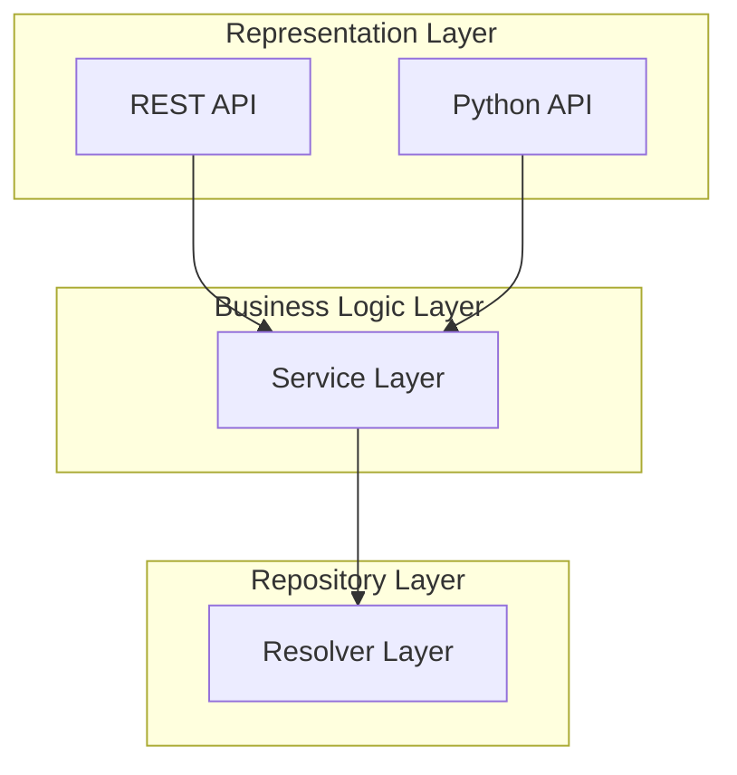

# Backend coding guidelines
This document outlines the coding guidelines for the backend of the project. It is intended to ensure consistency, readability, and maintainability of the codebase.

## Key principles
1. Code should be easy to read and understand. Use meaningful variable and function names, and avoid complex logic where possible.
2. Follow a consistent coding style throughout the codebase. This includes naming conventions, indentation, and file organization.
3. Write modular code that can be easily tested and reused. Break down large functions into smaller, more manageable pieces.
4. Document your code thoroughly. Use comments to explain complex logic, and provide clear documentation for public APIs.
5. Write tests to ensure your code works as expected. Use automated testing frameworks whenever possible.

We follow the [Google Python Style Guide](https://google.github.io/styleguide/pyguide.html) with some adjustments as a reference for our coding style.

We also have some specific guidelines for the python codebase outlined in the [Python coding guidelines](./python.md).

## Backend architecture
We follow the [Three Layer Architecture](https://en.wikipedia.org/wiki/Multitier_architecture) for the backend codebase.
The main motivation for this architecture is to separate concerns and make the codebase more maintainable and scalable.
For example, it allows you to easily add new features, change existing ones, or replace the database without affecting the business logic or API layer.

We enforce the Three Layer Architecture for the backend codebase:
1. **API Layer**: This layer handles HTTP requests and responses. It defines the endpoints and their behavior.
2. **Service Layer**: This layer contains the business logic of the application. It processes data, applies rules, and coordinates with the resolver layer.
3. **Resolver Layer**: This layer interacts with the database and handles database operations.

Note: In our current design, we require a separate layer for the Python API. This layer consumes the service layer and exposes a Python interface to use LightlyStudio without a UI interface.

4. **Python API**: This layer defines the Python API to use LightlyStudio without a UI interface.

Here is a diagram describing the backend architecture:



Here is the base folder structure for the backend codebase following Three Layer Architecture:

```
src/
    lightly_studio/
        api/                # API layer
            routes/         # API endpoints
                samples.py  # Sample-related API endpoints
            app.py          # FastAPI application instance
            middlewares/    # Middleware for the API (e.g. exception handling)
                exception_handler.py  # Middleware to handle exceptions globally

        services/           # Service layer
            samples.py      # Service for handling sample operations
            classifier/     # Service for handling classifier operations

        resolvers/          # Resolvers layer
            samples.py      # Sample resolvers
            dependencies/   # Dependencies for the resolvers (connecting to database, etc.)
                database.py # Database session management
            
        models/             # Database models
            samples.py      # Sample model definitions
```

### API Layer
This is the topmost layer in the backend architecture and the one that users interact with directly. As a best practice, no business logic should be present inside the API layer. The API layer typically interacts with the service layer.

### Dependency Injection

FastAPI uses the `Depends` mechanism for dependency injection, which allows us to declare dependencies that are automatically provided by the framework. This is particularly useful for managing services and repositories.

We use dependency functions to instantiate and inject services and resolvers across different layers. This helps maintain modularity and makes it easy to swap implementations or add middleware logic.

#### Example: Injecting a Service with Dependencies

```python
# src/lightly_studio/api/dependencies/samples.py

from fastapi import Depends
from sqlmodel import Session
from lightly_studio.services.samples import SampleService
from lightly_studio.db.session import get_session

def get_sample_service(session: Session = Depends(get_session)) -> SampleService:
    return SampleService(session=session)
```

This function creates and returns an instance of `SampleService` with its required `session` dependency.

#### Usage in API Routes

```python
from lightly_studio.api.dependencies.samples import get_sample_service

@router.post("/samples")
def create_sample(
    service: SampleService = Depends(get_sample_service), 
    sample: Annotated[ImageCreate, Body()]
) -> ImageView:
    return service.create_sample(sample)
```

This pattern ensures clean separation of concerns and consistent dependency management across the backend architecture.

#### Input parameters in API endpoints
FastAPI [has comprehensive documentation on how to define input parameters for API endpoints](https://fastapi.tiangolo.com/tutorial/). 
We cover the most commonly used patterns below:

- **Path parameters**: These are part of the URL path and are defined using curly braces `{}`. For example, `/samples/{sample_id}`.
```python
@router.get("/samples/{sample_id}")
def get_sample(
    sample_id: Annotated[UUID, Path(title="Sample Id")],
) -> ImageView:
    ...
```

- **Query parameters**: These are passed in the URL after a `?` and are defined using the `Query` annotation in the function signature. For example, `/samples?dataset_id=123`.

```python
class QueryParams(BaseModel):
    dataset_id: UUID

@router.get("/samples")
def get_samples(
    query_params: Annotated[QueryParams, Query()]
) -> list[ImageView]:
    ...
```

- **Request body**: This is used for POST, PUT, and PATCH requests where the data is sent in the request body. It is recommended to use a Pydantic model to validate the request body.

```python
@router.post("/samples")
def create_sample(
    sample: Annotated[ImageCreate, Body()]
) -> ImageView:
    ...
```

- **Combined parameters example**: You can combine path, query, and body parameters in a single endpoint.

```python
class BodyParams(SQLModel):
    """User input model for creating a user."""
    some_body_parameter: str

class QueryParams(BaseModel):
    query_parameter: str

@router.post("/show-params/{path_parameter}")
def show_params(
    # First we define a path parameter
    path_parameter: Annotated[str, Path(title="Example of a path parameter")],
    # Then we define a query parameter using Query
    query_params: Annotated[QueryParams, Query()],
    # Finally we define a body parameter using Body
    body_params: Annotated[BodyParams, Body()],
) -> None:
    """Show parameters usage."""
    print(f"Path parameter: {path_parameter}")
    print(f"Query parameter: {query_params.query_parameter}")
    print(f"Body parameter: {body_params.some_body_parameter}")
```

#### API Layer conventions
Follow these conventions for API endpoints:

```python
from fastapi import APIRouter, Depends
from lightly_studio.api.models.samples import ImageCreate, ImageView
from lightly_studio.services.samples import SampleService

# src/lightly_studio/api/routes/samples.py
router = APIRouter()

# We use the service layer to handle business logic and interact with resolvers
@router.post("/samples")
def create_sample(
    service: SampleService = Depends(get_sample_service),
    sample: Annotated[ImageCreate, Body()],
) -> ImageView:
    """Create a new sample."""
    return service.create_sample(sample)

@router.get("/samples/{sample_id}")
def get_sample_by_id(
    service: SampleService = Depends(get_sample_service),
    sample_id: Annotated[UUID, Path()],
) -> ImageView:
    """Get a sample by ID."""
    return service.get_sample_by_id(sample_id)
```

### Service Layer
The service layer encapsulates the business logic of the application. It processes data, enforces business rules, and coordinates with the resolvers layer to persist or retrieve data. The service layer should remain agnostic to HTTP concerns and not directly handle requests or responses. This layer also implements critical business validations, including authorization and role-based access control (RBAC).

#### Service Layer conventions
- Use `lightly_studio.services` for defining service classes.
- Class-based services should be used to encapsulate business logic.
- Follow these conventions for service classes:

```python
# src/lightly_studio/services/samples.py
from sqlmodel import Session
from lightly_studio.resolvers import samples_resolver
from lightly_studio.api.v1.models.samples import ImageCreate, ImageView

class SampleService:
    """Service class for sample operations."""

    def __init__(self, session: Session) -> None:
        self.session = session

    def create_sample(self, sample: ImageCreate) -> ImageView:
        """Create a new sample."""
        return samples_resolver.create_sample(session=self.session, sample_create=sample)

    def create_sample_with_metadata(self, sample: ImageCreate) -> ImageView:
        """Create a new sample with computed metadata."""
        # Put business logic here
        metadata = _compute_metadata_for_sample(sample)
        new_sample = samples_resolver.create_sample(session=self.session, sample_create=sample)
        new_metadata = metadata_resolver.create_metadata(
            session=self.session, 
            metadata=metadata, 
            sample_id=sample.sample_id
        )
        return new_sample, new_metadata

    def get_sample_by_id(self, sample_id: UUID) -> ImageView:
        """Get a sample by ID."""
        return samples_resolver.get_sample_by_id(session=self.session, sample_id=sample_id)
```

### Resolvers Layer

The resolvers layer interacts with the database. It handles database operations and should not contain any business logic.

#### Resolvers Layer conventions
- Use `lightly_studio.resolvers` for defining resolvers.
- Resolvers are implemented as modules.
- Validation is one of the most important aspects of the resolvers.
- Use descriptive names for resolver files that indicate their functionality. E.g. `samples_resolver.py`, `classifier_resolver.py`, etc.
- Follow these conventions:

```python
# src/lightly_studio/resolvers/samples_resolver.py
from __future__ import annotations

from sqlmodel import Session, select
from lightly_studio.models.sample import Sample, ImageCreate

def create_sample(session: Session, sample_create: ImageCreate) -> Sample:
    """Create a new sample in the database."""
    db_sample = Sample.model_validate(sample_create)
    session.add(db_sample)
    session.commit()
    session.refresh(db_sample)
    return db_sample
```

## Models
Models are used to define the structure of data in the application. They are used in both the API layer and the resolvers layer. We use `SQLModel` for defining database models, which allows us to define models that can be used for both API requests/responses and database operations.

We store models in the `src/lightly_studio/models` directory. The models are organized into different files based on their functionality. For example, we have a `sample.py` file to define the models for samples such as:
- `SampleBase` - the base model describing common fields for all sample-related models.
- `ImageTable` - the main model for samples defining table structure and relationships.
- `ImageCreate` - a model used when creating a new sample, which may contain only a subset of fields.
- `SampleUpdate` - a model used for updating existing samples, which may contain only the fields that can be updated.
- `ImageView` - a model used for viewing samples, which may contain additional fields like timestamps or relationships.
- `SampleLink` - a model used for linking samples, which may contain fields like `sample_id`, `linked_sample_id`, and `relationship_type`. Typically only needed for many-to-many relationships.

Usually only "Base", "Table", "Create", "Update", and "View" models are needed for each entity.

If a model is large or complex, it can be split into multiple files. For example, for annotations we can have a separate directory `src/lightly_studio/models/annotations` with files like `object_detection.py`, `semantic_segmentation.py`, `instance_segmentation.py`, and `classification.py`.

### Example of model structure
```python
# src/lightly_studio/models/sample.py
"""Sample model for the lightly_studio application."""

from __future__ import annotations

from datetime import datetime, timezone
from uuid import UUID, uuid4

from sqlmodel import Field, Relationship, SQLModel

# This model defines all common fields for sample-related models.
class SampleBase(SQLModel):
    """Base model for sample-related models."""
    
    file_name: str = Field(description="The name of the image file")
    width: int = Field(description="The width of the image in pixels")
    height: int = Field(description="The height of the image in pixels")
    collection_id: UUID = Field(default=None, foreign_key="collections.collection_id", description="The collection ID to which the sample belongs")
    file_path_abs: str = Field(description="The absolute path to the image file")

# This model defines the structure of the Sample table in the database.
class Sample(SampleBase, table=True):
    """Sample table model."""

    __tablename__ = "samples"
    sample_id: UUID = Field(default_factory=uuid4, primary_key=True)
    created_at: datetime = Field(default_factory=lambda: datetime.now(timezone.utc))
    updated_at: datetime = Field(default_factory=lambda: datetime.now(timezone.utc))
    
    # Relationships
    annotations: list["BoundingBoxAnnotation"] = Relationship(back_populates="sample")
    tags: list["Tag"] = Relationship(back_populates="samples", link_model=SampleTagLink)
    embeddings: list["SampleEmbedding"] = Relationship(back_populates="sample")

# This model is used to validate and describe the input when creating a new sample.
class ImageCreate(SampleBase):
    """Sample create model."""
    pass
        
# This model is used to validate and describe the output, e.g. in the API response.
# It may contain reduced fields compared to the Sample model to optimize response size.
class ImageView(SampleBase):
    """Sample view model."""
    sample_id: UUID

# This model is used to link samples and tags.
class SampleTagLink(SQLModel, table=True):
    """SampleTagLink links Sample and Tag in a Many-to-Many relationship."""
    
    sample_id: UUID | None = Field(
        default=None, foreign_key="samples.sample_id", primary_key=True
    )
    tag_id: UUID | None = Field(
        default=None, foreign_key="tags.tag_id", primary_key=True
    )
```

### Problematic typing cases
FastAPI relies on type definitions for validation, serialization, and documentation generation. When models are imported within `TYPE_CHECKING` blocks, FastAPI cannot access these types at runtime, causing them to appear as `unknown` in the generated schema.

**Solution:** Avoid using `TYPE_CHECKING` imports for models used as field types. Instead, use inline type definitions to prevent circular imports while maintaining proper schema generation.

Example from [annotation_base.py](../../lightly_studio/src//lightly_studio/models/annotation/annotation_base.py):

```python
class AnnotationView(BaseModel):
    ...

    class AnnotationLabel(SQLModel):
        annotation_label_name: str

    annotation_label: AnnotationLabel
```

Instead of abstracting type in different files rather define it locally
```
class ImageView(BaseModel):
    class SampleMetadataView(SQLModel):
        data: dict[str, Any]
   metadata_dict: Optional[SampleMetadataView] = None 
```

## Error handling
FastAPI provides built-in error handling when we use properly defined input and view models.

We don't handle exceptions in the `services` or `resolvers` layers through try-catch blocks. Instead, we let exceptions bubble up to be handled by the API layer.

FastAPI uses the provided type hints to verify that the input matches expectations.

**Are all fields provided? Are the types correct?** If the client makes an invalid API call, they will receive an error message. **(HTTP CODE 422)**

**FastAPI also uses the type hints to validate the response model.** If our code has issues and we try to return incorrect fields or types, FastAPI will also throw an error. **(HTTP CODE 500)**

We handle errors in the service layer by raising custom exceptions that are then handled in the API layer. This allows us to provide meaningful error messages and HTTP status codes to the client. See [Service Error Handling](#service-error-handling) section below for more details.

**Note:** We avoid using specific `HTTPException` because the API/REST layer is not the only consumer of the exceptions. It is important to raise errors in the service layer to provide error details for both the API and Python API layers.

Motivation for this approach:
- The API is not the only consumer of the service layer, and it is important to get error details from the service layer to both the API layer and Python API layer.
- It simplifies the error handling logic in the API layer.
- It allows us to focus on the business logic without worrying about specific error codes.

For example, handling NOT_FOUND in the service layer would look like this:

### Service Error Handling
```python
# src/lightly_studio/services/samples.py
from sqlmodel import select
from lightly_studio.services.exceptions import ServiceError
from lightly_studio.services.errors import STATUS_NOT_FOUND

class SampleService:
    def get_sample_by_id(self, sample_id: UUID) -> ImageView:
        """Get a sample by ID."""
        statement = select(Sample).where(Sample.sample_id == sample_id)
        sample = self.session.exec(statement).first()
        if not sample:
            raise ServiceError(
                code=STATUS_NOT_FOUND, 
                message=f"Sample with id {sample_id} not found"
            )
        return ImageView.model_validate(sample)

# src/lightly_studio/services/exceptions.py
"""Custom exceptions for the lightly_studio service layer."""

from __future__ import annotations

class ServiceError(Exception):
    """Service layer exception with HTTP error code and details."""

    def __init__(self, code: int, message: str) -> None:
        """Initialize ServiceError.

        Args:
            code: HTTP status code (e.g., 404, 400, 500).
            message: Error message describing what went wrong.
        """
        self.code = code
        self.message = message
        super().__init__(message)

    def __str__(self) -> str:
        """Return string representation of the error."""
        return f"ServiceError({self.code}): {self.message}"

# src/lightly_studio/services/errors.py
# Common status codes for convenience based on HTTP status codes
STATUS_BAD_REQUEST = 400
STATUS_UNAUTHORIZED = 401
STATUS_FORBIDDEN = 403
STATUS_NOT_FOUND = 404
STATUS_CONFLICT = 409
# ... etc.

# src/lightly_studio/api/app.py
from fastapi import HTTPException, Request

@app.exception_handler(ServiceError)
async def service_error_handler(_request: Request, exc: ServiceError) -> HTTPException:
    """Handle service layer errors."""
    return HTTPException(status_code=exc.code, detail=exc.message)
```

