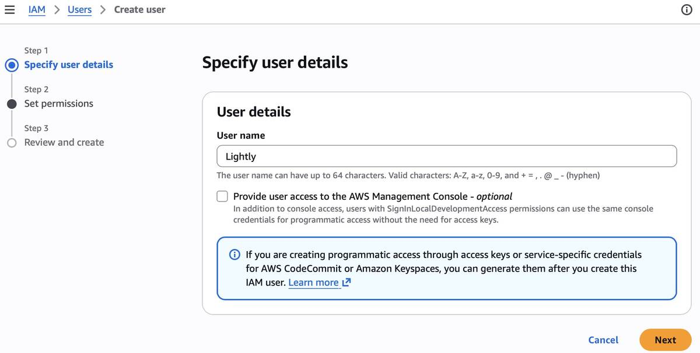
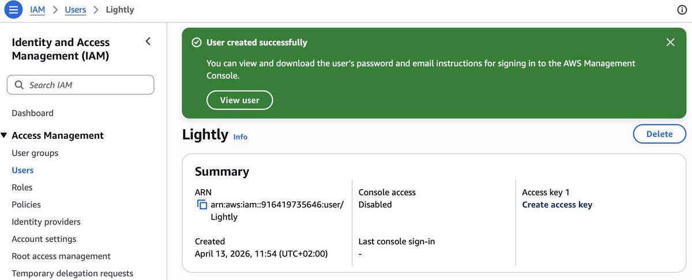
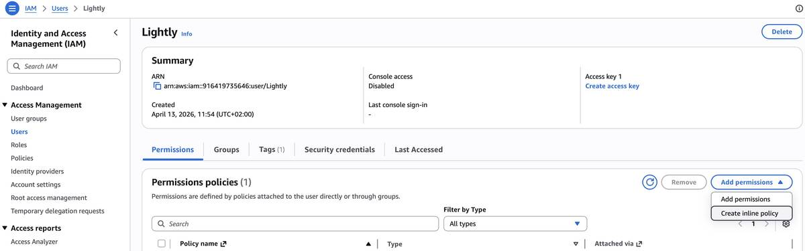
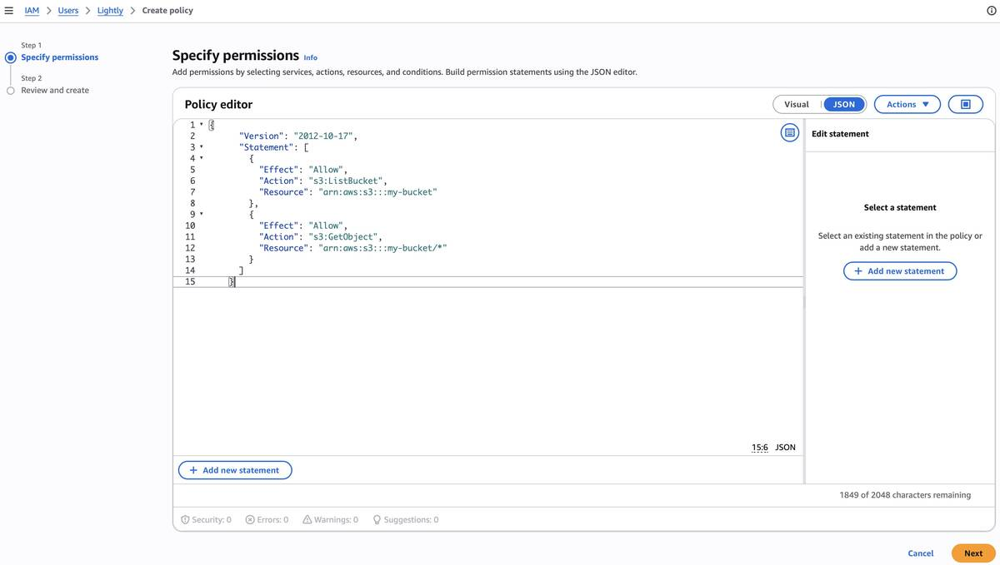
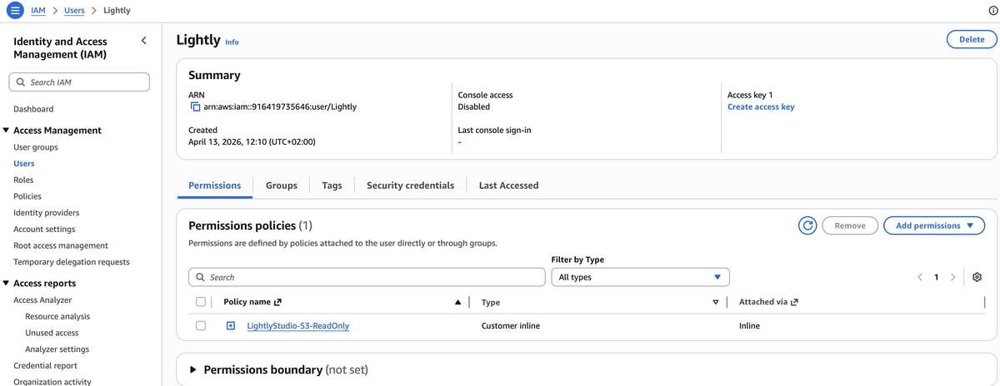
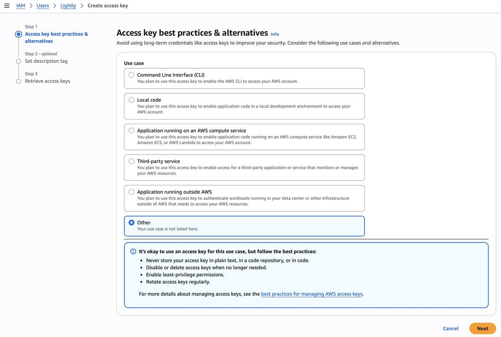
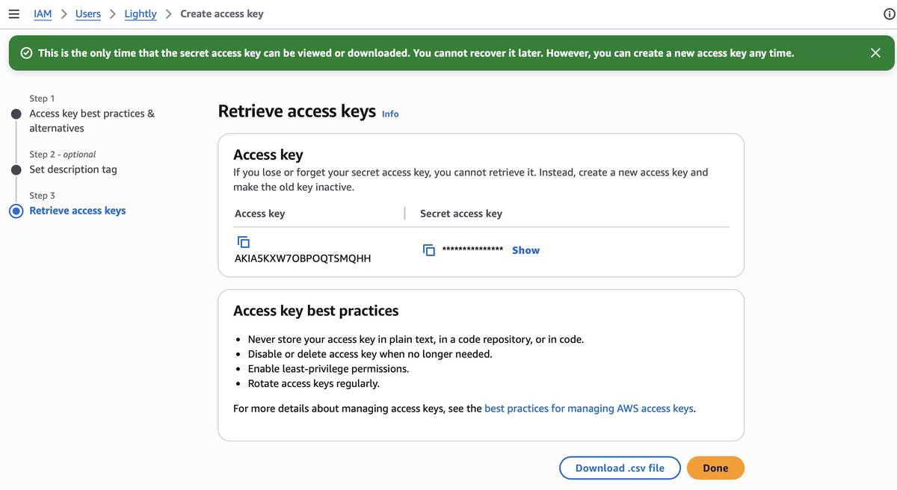

# AWS S3 Setup

This guide walks through creating an AWS IAM user with the permissions LightlyStudio needs to
access your S3 bucket. Once you have the credentials, follow
[Cloud Storage](index.md#step-2-add-credentials-in-the-gui) to add them in the GUI.

## Required Permissions

LightlyStudio needs the following S3 permissions on your bucket:

- `s3:ListBucket` — list objects in the bucket
- `s3:GetObject` — read images and videos

## Step 1: Create an IAM User

1. Go to the
   [AWS IAM console](https://console.aws.amazon.com/iamv2/home?#/users)
   and click **Create user**. Enter a name (e.g. `Lightly`) and click **Next**.

    { width="100%" }

2. On the **Set permissions** page, skip adding permissions for now. You will add an
   inline policy after the user is created. Click **Next**, then **Create user**.

3. You should see a success banner. Click **View user** to open the user detail page.

    { width="100%" }

## Step 2: Add an Inline Policy

1. On the user detail page, open the **Permissions** tab. Click
   **Add permissions** → **Create inline policy**.

    { width="100%" }

2. Switch to the **JSON** tab and paste the policy below. Replace `my-bucket` with
   the name of your S3 bucket. Click **Next**, give the policy a name (e.g.
   `LightlyStudio-S3-ReadOnly`), and click **Create policy**.

    ```json title="lightly-s3-policy.json"
    {
      "Version": "2012-10-17",
      "Statement": [
        {
          "Effect": "Allow",
          "Action": "s3:ListBucket",
          "Resource": "arn:aws:s3:::my-bucket"
        },
        {
          "Effect": "Allow",
          "Action": "s3:GetObject",
          "Resource": "arn:aws:s3:::my-bucket/*"
        }
      ]
    }
    ```

    { width="100%" }

## Step 3: Create an Access Key

1. Back on the user detail page, find the **Create access key** link in the summary
   (top-right corner).

    { width="100%" }

2. Select **Other** as the use case and click **Next**.

    { width="100%" }

3. Store the **Access key** and **Secret access key** in a secure location. You will
   not be able to view the secret key again.

    { width="100%" }

## Next Step

Head to [Cloud Storage — Step 2](index.md#step-2-add-credentials-in-the-gui) to
enter these credentials in the LightlyStudio Enterprise GUI.
