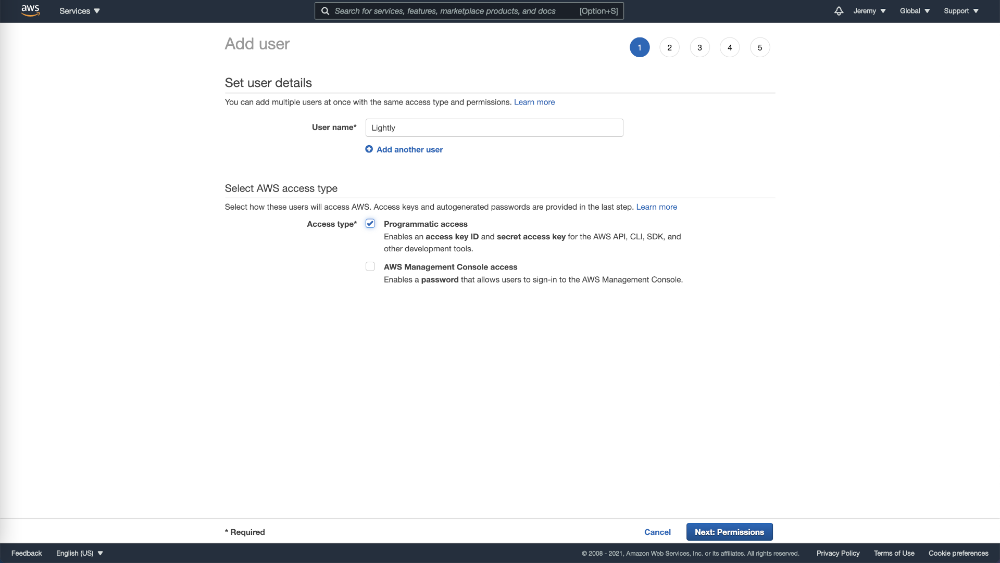
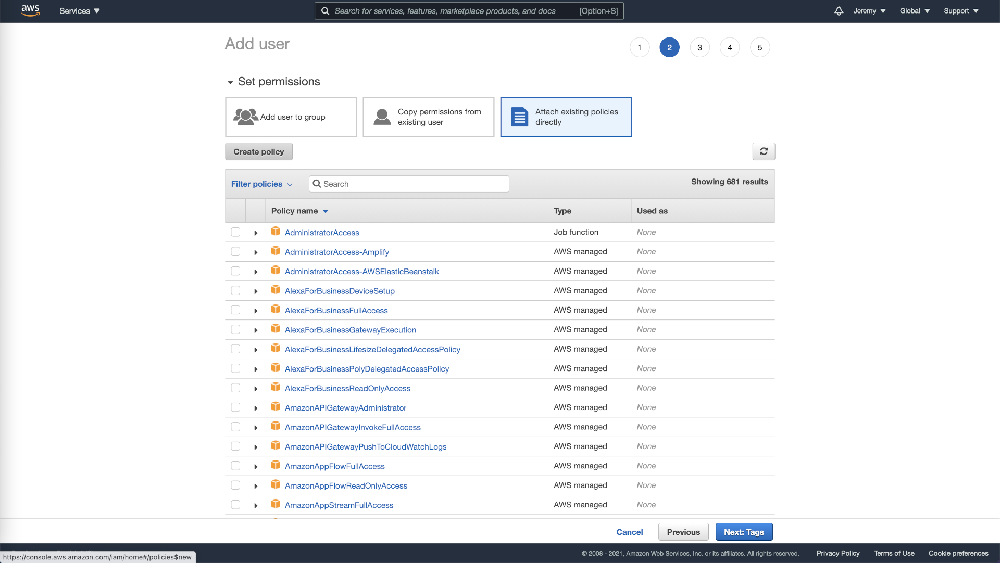
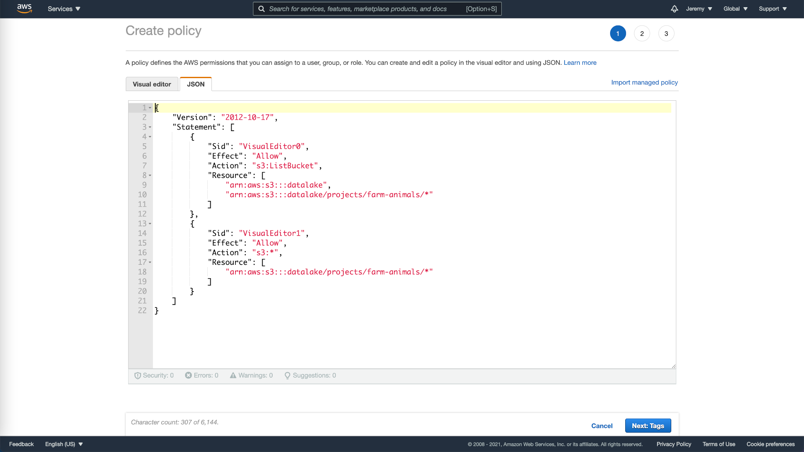
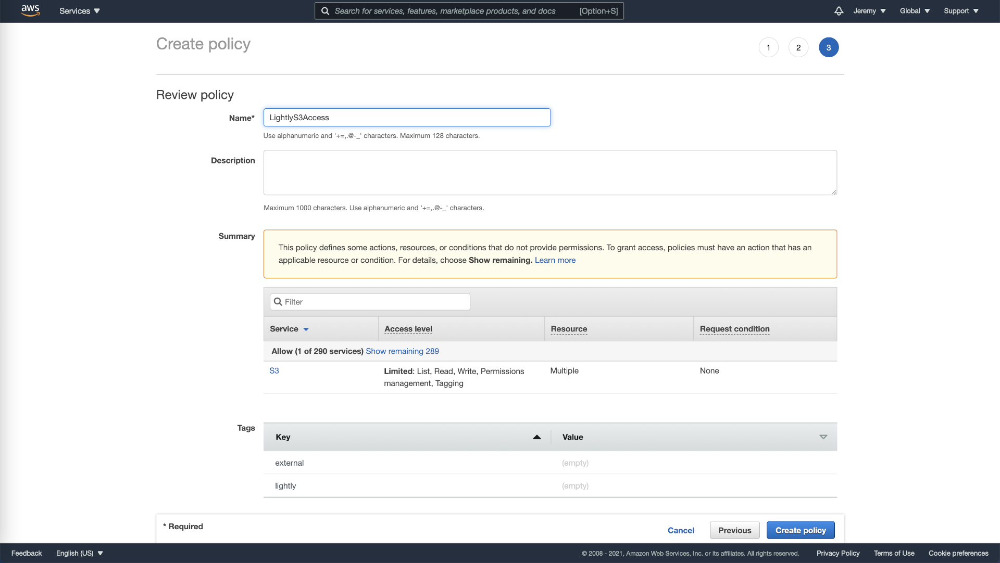
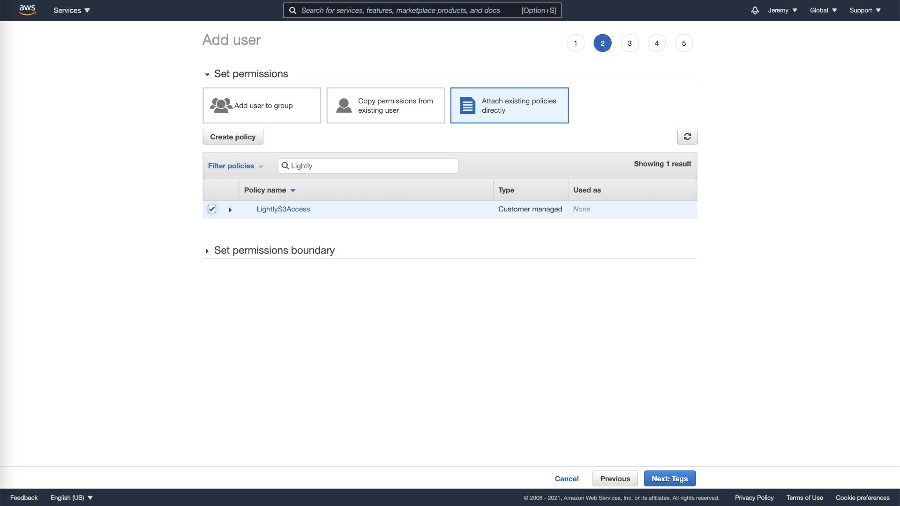
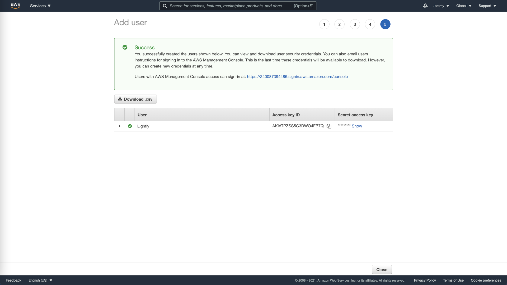

# AWS S3 Setup

This guide walks through creating an AWS IAM user with the permissions LightlyStudio needs to
access your S3 bucket. Once you have the credentials, follow
[Cloud Storage](index.md#step-2-add-credentials-in-the-gui) to add them in the GUI.

## Required Permissions

LightlyStudio needs the following S3 permissions on your bucket:

- `s3:ListBucket` — list objects in the bucket
- `s3:GetObject` — read images and videos

## Create an IAM User

1. Go to the
   [AWS IAM console](https://console.aws.amazon.com/iamv2/home?#/users)
   and create a new user. Choose a unique name and select **Programmatic access** as the
   access type.

    { width="100%" }

2. Click **Attach existing policies directly**, then **Create policy** to define a new
   policy for LightlyStudio.

    { width="100%" }

3. Switch to the **JSON** tab and paste the policy below. Replace `my-bucket` with
   the name of your S3 bucket.

    ```json title="lightly-s3-policy.json"
    {
      "Version": "2012-10-17",
      "Statement": [
        {
          "Effect": "Allow",
          "Action": "s3:ListBucket",
          "Resource": "arn:aws:s3:::my-bucket"
        },
        {
          "Effect": "Allow",
          "Action": "s3:GetObject",
          "Resource": "arn:aws:s3:::my-bucket/*"
        }
      ]
    }
    ```

    { width="100%" }

    !!! tip
        To restrict access to a specific folder, change the second resource to
        `arn:aws:s3:::my-bucket/my-folder/*`.

4. Click **Next**, add tags as you see fit, give your policy a name (e.g.
   `LightlyStudio-S3-Access`), and create it.

    { width="100%" }

5. Return to the user creation page, reload the policy list, and select the policy
   you just created. Continue creating the user.

    { width="100%" }

6. Store the **Access Key ID** and **Secret Access Key** in a secure location. You will
   not be able to view the secret key again.

    { width="100%" }

## Next Step

Head to [Cloud Storage — Step 2](index.md#step-2-add-credentials-in-the-gui) to
enter these credentials in the LightlyStudio Enterprise GUI.
