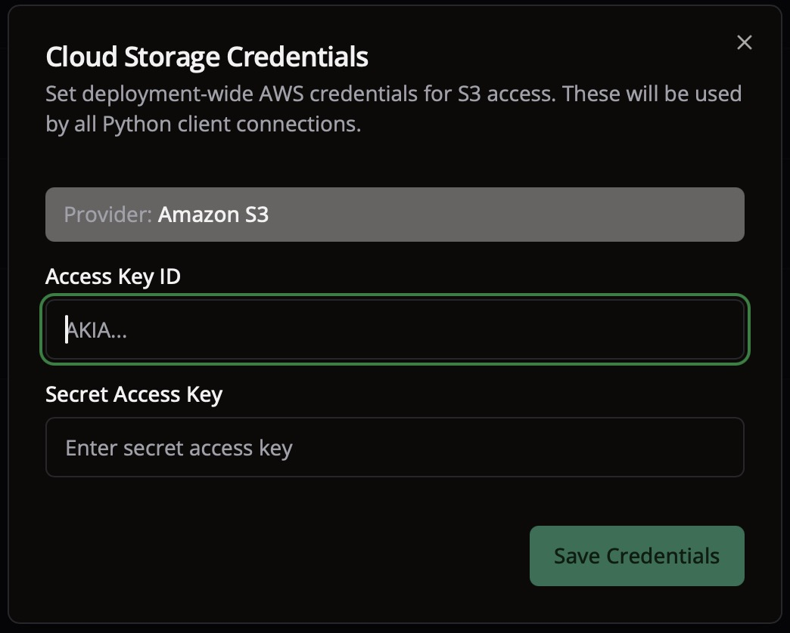

# Cloud Storage

LightlyStudio Enterprise lets admins configure cloud storage credentials centrally. Once set
up, every Python client that calls `ls.connect()` receives the credentials automatically, no per-user setup is needed.

Currently supported: **AWS S3**. Support for GCS and Azure is planned.

## How It Works

1. **Admin creates cloud provider credentials** with read/write access to the storage bucket.
   See [AWS S3 Setup](aws.md) for a step-by-step guide.
2. **Admin saves the credentials** in the LightlyStudio Enterprise GUI.
3. **Python clients call `ls.connect()`** and receive the credentials automatically.

## Step 1: Get Your Cloud Credentials

Follow the guide for your cloud provider to create credentials with the required permissions:

- [AWS S3](aws.md)

## Step 2: Add Credentials in the GUI

1. Open your LightlyStudio Enterprise instance in the browser.
2. Open the **Cloud Storage Credentials** dialog.
3. Enter the credentials you created in the previous step.
4. Click **Save Credentials**.

{ width="100%" }

The credentials are now stored on the server and shared with all Python client connections.

## Step 3: Use Cloud Storage from Python

If you have not set up Python access yet, start with
[Connect from Python](../connect.md). After calling `ls.connect()`, cloud credentials are
injected into your local environment automatically, so you can use remote paths directly
without any extra client-side setup.

```python title="enterprise_cloud_storage.py"
import lightly_studio as ls

ls.connect()

dataset = ls.ImageDataset.load_or_create("s3_dataset")
dataset.add_images_from_path(path="s3://my-bucket/images/")
```

!!! note
    The Python client must have the cloud storage dependencies installed:
    ```shell
    pip install "lightly-studio[cloud-storage]"
    ```
    See [Using Cloud Storage](../../api/index.md#using-cloud-storage) for more details on
    supported cloud operations.
