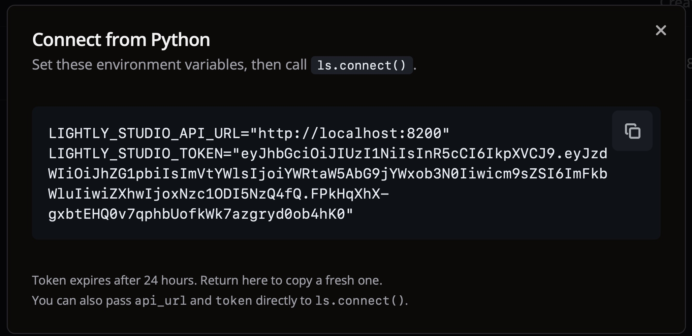

# How to Connect from Python

This guide shows how to connect to your LightlyStudio Enterprise instance from a Python
environment. It is intended for admins who populate or update datasets from Python. Regular users
can use the web app without connecting from Python.

Once connected, the Python API works identically to the open-source version. The only difference
is that data is stored in a shared database accessible to your entire team.

This guide assumes you are already logged in to your LightlyStudio Enterprise instance with an
admin account.

## Prerequisites

- Admin access to a running LightlyStudio Enterprise instance
- `lightly_studio` installed (`pip install lightly-studio`). Use exactly the same version as the server for best compatibility. You can check the server version in the GUI footer.

## Step 1: Get Your Connection Credentials

1. Open your LightlyStudio Enterprise instance in the browser.
2. Go to the `Datasets` page and click the **"Connect from Python"** button. This button is only
   available to admins.
3. A dialog displays two values:
    - `LIGHTLY_STUDIO_API_URL` — the base URL of your enterprise instance
    - `LIGHTLY_STUDIO_TOKEN` — a JWT token for authentication
4. Take note of both values. You will need them to connect from Python.

The dialog looks like this:

{ width="100%" }

## Step 2: Configure Your Environment

=== ".env File (Recommended)"

    Create a `.env` file in your working directory. LightlyStudio reads it automatically. Just paste the values you copied from the GUI:

    ```shell title=".env"
    LIGHTLY_STUDIO_API_URL="http://your-server:8100"
    LIGHTLY_STUDIO_TOKEN="eyJhbGciOiJIUzI1NiIs..."
    ```

=== "Environment Variables"

    You can also set them as environment variables in your shell.
    ```shell title="export_env_vars.sh"
    export LIGHTLY_STUDIO_API_URL="http://your-server:8100"
    export LIGHTLY_STUDIO_TOKEN="eyJhbGciOiJIUzI1NiIs..."
    ```

=== "Pass Parameters Directly"

    You can also pass the values directly to `ls.connect()`. Explicit parameters take precedence
    over environment variables.

    ```python title="connect_explicit.py"
    import lightly_studio as ls

    ls.connect(
        api_url="http://your-server:8100",
        token="eyJhbGciOiJIUzI1NiIs...",
    )
    ```

## Step 3: Connect and Use the API

```python title="enterprise_connect.py"
import lightly_studio as ls

# Reads LIGHTLY_STUDIO_API_URL and LIGHTLY_STUDIO_TOKEN from .env
ls.connect()

# From here on, the API works exactly as in the open-source version,
# but data is stored in the shared enterprise database.
dataset = ls.ImageDataset.load("my_dataset")
for sample in list(dataset)[:3]:
    print(f"{sample.file_name} has {len(sample.annotations)} annotations")
```

!!! note
    After `ls.connect()`, all dataset operations use the enterprise database instead of
    a local DuckDB file. You do **not** need to call `ls.start_gui()` — the GUI is already
    running on the enterprise server.

## API Reference for ls.connect()

::: lightly_studio.enterprise.connect
