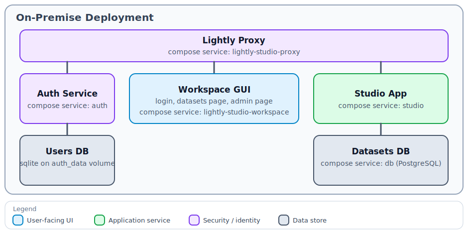

# On-Premise Deployment

The on-premise deployment model is for teams that want to run LightlyStudio Enterprise
on their own infrastructure. This gives you full control over the deployment, data
storage, and security. You can run it fully offline or air-gapped if needed.

## Components of the On-Premise Deployment

{ width="100%" }

- `Lightly Proxy` exposes the deployment.
- `Auth Service` handles authentication.
- `Workspace GUI` provides the login, datasets, and admin pages.
- `Studio App` provides the core application including the backend API and frontend.
- `Datasets DB` stores enterprise dataset metadata in PostgreSQL.

For the user-facing security and architecture overview, see [Security and Architecture](security.md).

