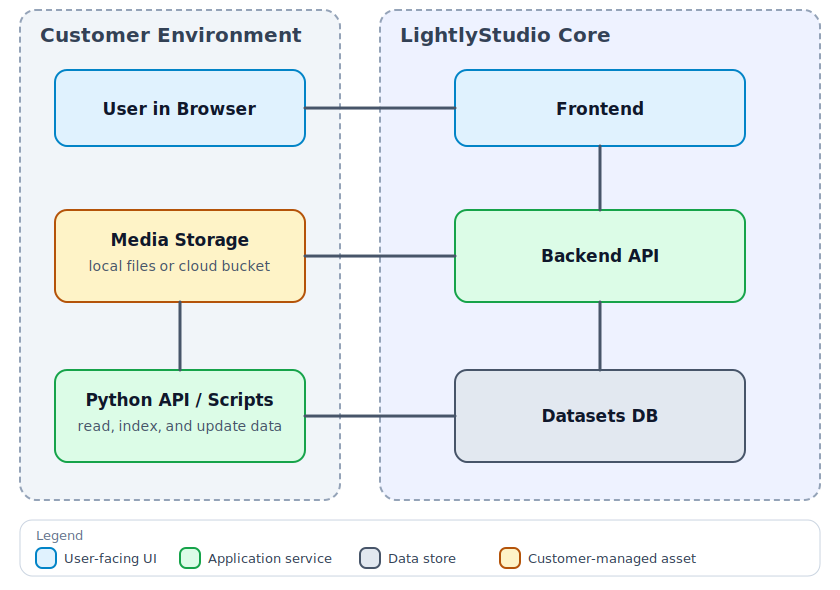
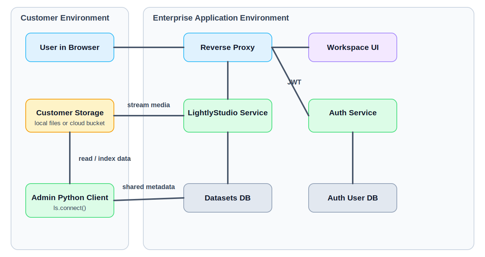

# Security Considerations

Lightly is designed for secure enterprise-grade machine learning workflows. Across all deployment
models, raw images and videos are never stored on Lightly servers.

## Certifications

For the latest legal, privacy, and compliance information, see
[Lightly Legal: Privacy & Security](https://lightly.ai/legal).

- ISO 27001: Lightly is ISO 27001 certified, ensuring the confidentiality, integrity, 
  and availability of your data through robust information security management.
- GDPR: Lightly is fully compliant with the General Data Protection Regulation (GDPR),
  protecting user privacy and upholding strict data handling standards.

## Architecture Overview

The diagrams below show the shared architecture and the enterprise topology.

### Core LightlyStudio Architecture

{ width="100%" }

This shows the shared architecture of OSS and Enterprise.

- In OSS, a local Python script indexes data, computes embeddings, stores metadata in a local
  DuckDB file, and can start the UI with `ls.start_gui()`.
- In Enterprise, the web app runs on a central server and the datasets database is used by
  multiple users.
- In both cases, raw images and videos stay in customer-controlled storage and are streamed when
  needed.

### Enterprise Deployment Topology

{ width="100%" }

This is the enterprise view for users and admins.

- Regular users use the web app in the browser.
- Admin Python workflows run separately and connect with `ls.connect()`.
- The `Auth Service` handles multi-user authentication.
- The datasets database stores metadata, annotations, tags, captions, and embeddings. Raw images
  and videos are not copied into that database.

If you operate your own deployment, see [On-Premise Deployment](on-premise.md) for an in-depth architecture overview.

## Where Computation Happens

- Data ingestion, indexing, and embedding generation run in the Python process that adds data.
- In OSS, this is usually the same script that later starts the UI with `ls.start_gui()`.
- In Enterprise, admin Python scripts call `ls.connect()` and then use the same Python API against the enterprise datasets database.

## Deployment-Specific Data Sent to or Stored by Lightly

- OSS: Only analytics data is sent to Lightly. The OSS version can also be run fully offline.
- Lightly-Hosted: To operate the service, Lightly stores analytics, user account information, and
  dataset metadata, including annotations. Raw images and videos are streamed from your storage to
  the browser when needed, but are never stored on Lightly servers.
- On-Premise / Self-Hosted: Nothing is sent to Lightly. The deployment can be fully offline and
  air-gapped.
