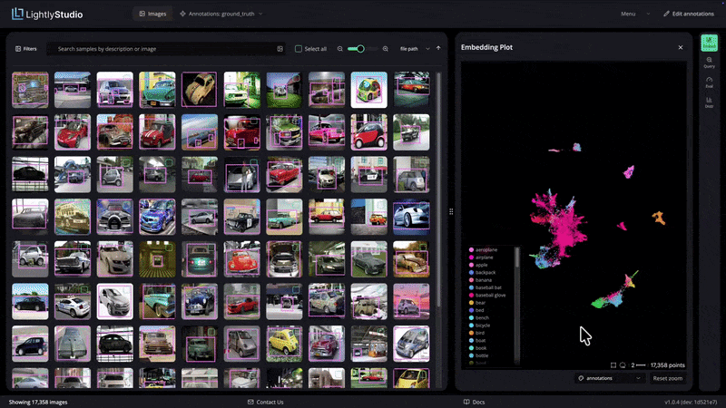

# Welcome to LightlyStudio!

**[LightlyStudio](https://www.lightly.ai/lightly-studio)** is an open-source tool designed to unify
your data workflows from curation, annotation and management. Built with Rust for speed and
efficiency, it lets you work seamlessly with datasets like COCO and ImageNet, even on a MacBook Pro
with an M1 chip and 16 GB of memory.

<p align="center">
  
</p>

<p align="center">The embedding plot shows how images relate to each other, with a preview on hover. A lasso selection filters the grid to one cluster. A search for "coffee" finds a match, and the annotation editor opens to label it.</p>
<p align="center"><strong>⚡ Tested with 2M+ images, embeddings included, on a single MacBook (M1, 16GB RAM).</strong></p>


## Installation

LightlyStudio works on Windows, Linux, and macOS with **Python 3.9 to 3.14**. We recommend
**Python 3.10** for the best compatibility with plugins such as SAM autolabeling.

```shell
pip install lightly-studio
```

??? tip "Recommended: install into a virtual environment"
    A virtual environment keeps LightlyStudio and its dependencies separate from other
    Python projects on your machine:

    === "Linux/macOS"

        ```shell
        python3 -m venv venv
        source venv/bin/activate
        pip install lightly-studio
        ```

    === "Windows"

        ```powershell
        python -m venv venv
        .\venv\Scripts\activate
        pip install lightly-studio
        ```

## Quickstart

Want to try LightlyStudio instantly? Run:

```shell
lightly-studio quickstart
```

This downloads the COCO example dataset on the first run (skipped on subsequent runs), loads it,
and starts the GUI server. Click the printed URL to open it in your browser. Use
`--force-download` to re-fetch the dataset, or `--port <N>` to serve on a custom port.

The examples below use the same example dataset by default, downloaded on the first run. Point
them at your own image, video, or YOLO/COCO dataset by changing the input path.

=== "COCO Object Detection"

    1. Create a file named `example_coco.py` with the following contents:

        ```python title="example_coco.py"
        import lightly_studio as ls

        # Download the example dataset (will be skipped if it already exists)
        dataset_path = ls.utils.download_example_dataset(download_dir="dataset_examples")

        dataset = ls.ImageDataset.load_or_create()
        dataset.add_samples_from_coco(
            annotations_json=f"{dataset_path}/coco_subset_128_images/instances_train2017.json",
            images_path=f"{dataset_path}/coco_subset_128_images/images",
        )
        # Optional: tag a subset of samples to filter them in the GUI. 
        dataset.query()[:10].add_tag("sample_subset")

        ls.start_gui()
        ```

    1. Run `python example_coco.py` in your terminal.
    1. Click on the printed URL to open the app in your browser.

=== "YOLO Object Detection"

    1. Create a file named `example_yolo.py` with the following contents:

        ```python title="example_yolo.py"
        import lightly_studio as ls

        # Download the example dataset (will be skipped if it already exists)
        dataset_path = ls.utils.download_example_dataset(download_dir="dataset_examples")

        dataset = ls.ImageDataset.load_or_create()
        dataset.add_samples_from_yolo(
            data_yaml=f"{dataset_path}/road_signs_yolo/data.yaml",
        )

        ls.start_gui()
        ```

    1. Run `python example_yolo.py` in your terminal.
    1. Click on the printed URL to open the app in your browser.

=== "Image Folder"

    1. Create a file named `example_image.py` with the following contents:

        ```python title="example_image.py"
        import lightly_studio as ls

        # Download the example dataset (will be skipped if it already exists)
        dataset_path = ls.utils.download_example_dataset(download_dir="dataset_examples")

        # Indexes the dataset, creates embeddings and stores everything in the database.
        dataset = ls.ImageDataset.load_or_create()
        dataset.add_images_from_path(
            path=f"{dataset_path}/coco_subset_128_images/images",
        )

        # Start the UI server on localhost port 8001.
        # Pass `host` and `port` parameters to customize.
        ls.start_gui()
        ```

    1. Run `python example_image.py` in your terminal.
    1. Click on the printed URL to open the app in your browser.

=== "Video Folder"

    1. Create a file named `example_video.py` with the following contents:

        ```python title="example_video.py"
        import lightly_studio as ls

        # Download the example dataset (will be skipped if it already exists)
        dataset_path = ls.utils.download_example_dataset(download_dir="dataset_examples")

        # Create a dataset and populate it with videos.
        dataset = ls.VideoDataset.load_or_create()
        dataset.add_videos_from_path(path=f"{dataset_path}/youtube_vis_50_videos/train/videos")

        # Start the UI server.
        ls.start_gui()
        ```

    1. Run `python example_video.py` in your terminal.
    1. Click on the printed URL to open the app in your browser.

!!! tip
    - Run `lightly-studio quickstart` to try LightlyStudio instantly — no Python script needed.
    - Call `lightly-studio gui` instead of `ls.start_gui()` in Python to skip reindexing
      an already-loaded dataset.

Ready for a complete, end-to-end workflow? Follow the tutorial
[Curate a Traffic CCTV Dataset for YOLO Training](tutorials/yolo-traffic-cctv-object-detection.md)
to explore embeddings, remove near-duplicates, auto-label, and train a model — or browse
[all tutorials](tutorials/index.md).

## How It Works

-  Your **Python script** creates a LightlyStudio **dataset**.
-  The `dataset.add_<samples>_from_<source>` functions read your samples and annotations, calculate
   embeddings, and save metadata to a local `lightly_studio.db` file (using DuckDB).
-  `ls.start_gui()` starts a **local backend API** server.
-  This server reads from `lightly_studio.db` and serves data to the **UI Application** running in
   your browser (by default `http://localhost:8001`).
-  Images and videos are streamed from their original local folder or remote storage for display in the UI.

## Feature Overview

### Datasets

<div class="grid cards small" markdown>

-   **[Image Dataset](dataset_setup/image_dataset.md)**

    [](dataset_setup/image_dataset.md)

-   **[Video Dataset](dataset_setup/video_dataset.md)**

    [](dataset_setup/video_dataset.md)

</div>

### Concepts

<div class="grid cards small" markdown>

-   **[Annotations](concepts_and_tools/annotations.md)**

    [](concepts_and_tools/annotations.md)

-   **[Tags](concepts_and_tools/tags.md)**

    [](concepts_and_tools/tags.md)

-   **[Captions](concepts_and_tools/captions.md)**

    [](concepts_and_tools/captions.md)

-   **[Metadata](concepts_and_tools/metadata.md)**

    [](concepts_and_tools/metadata.md)

-   **[Embeddings](concepts_and_tools/embeddings.md)**

    [](concepts_and_tools/embeddings.md)

</div>

### Tools

<div class="grid cards small" markdown>

-   **[Search and Filter](concepts_and_tools/search_and_filter.md)**

    [](concepts_and_tools/search_and_filter.md)

-   **[Export](concepts_and_tools/export.md)**

    [](concepts_and_tools/export.md)

-   **[Sampling](concepts_and_tools/sampling.md)**

    [](concepts_and_tools/sampling.md)

-   **[Plugins](concepts_and_tools/plugins.md)**

    [](concepts_and_tools/plugins.md)

-   **[Model Evaluation](concepts_and_tools/evaluation.md)**

    [](concepts_and_tools/evaluation.md)

</div>

## Python API

LightlyStudio has a powerful [Python interface](api/dataset.md). You can not only index datasets but
also query and manipulate them using code. It supports local and cloud-hosted image and video
folders; see [Using Cloud Storage](dataset_setup/cloud_storage.md) for setup and limitations.
