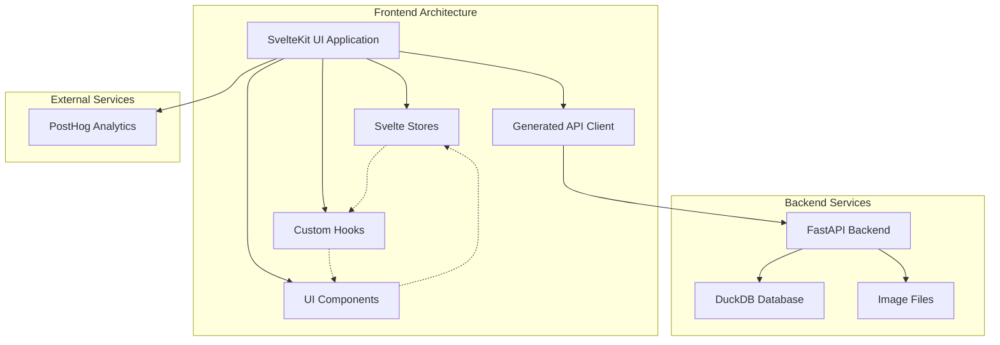

# Frontend Documentation

This document provides a comprehensive overview of the LightlyStudio frontend architecture, tools, and coding guidelines.

## Architecture Overview

LightlyStudio frontend is built as a static single-page application (SPA) using SvelteKit. The application provides a modern web interface for data curation, annotation, and management workflows.



### Key Architecture Components

- **SvelteKit Application**: Static SPA with client-side routing and state management
- **Generated API Client**: Type-safe client generated from OpenAPI specification using @hey-api/openapi-ts
- **Component System**: Modular UI built with Shadcn/Svelte and Bits-UI components
- **State Management**: Distributed state using Svelte stores and custom hooks
- **Styling**: Tailwind CSS with custom design system

## Development Tools

### Core Framework & Build Tools

- **[SvelteKit](https://svelte.dev/docs/kit/introduction)**: Frontend framework for building the SPA with routing and SSG capabilities
- **[Svelte](https://svelte.dev/docs/svelte/overview)**: Reactive component framework for building the UI
- **[Vite](https://vite.dev/)**: Fast build tool and development server
- **[TypeScript](https://www.typescriptlang.org/)**: Type-safe JavaScript for all application code

### UI & Styling

- **[Tailwind CSS](https://tailwindcss.com/)**: Utility-first CSS framework for styling
- **[Shadcn/Svelte](https://www.shadcn-svelte.com/)**: Pre-built component library with consistent styling
- **[Bits-UI](https://bits-ui.com/)**: Headless component library providing accessible UI primitives

### API & Data Management

- **[@hey-api/openapi-ts](https://heyapi.dev/)**: Generates type-safe API client from OpenAPI specification
- **[@tanstack/svelte-query](https://tanstack.com/query/latest)**: Data fetching, caching, and state management library
- **[Apache Arrow](https://arrow.apache.org/)**: Efficient data serialization for large datasets

#### TanStack Query Integration

LightlyStudio uses TanStack Query (formerly React Query) for efficient data fetching and state management. The integration leverages auto-generated query and mutation functions from the OpenAPI specification.

**Key Features:**

- **Generated Functions**: All API calls use type-safe functions generated from OpenAPI spec (e.g., `readSamples`, `updateAnnotation`)
- **Infinite Queries**: For paginated data like samples and annotations using `createInfiniteQuery`
- **Automatic Caching**: Intelligent query key structure minimizes unnecessary refetches
- **Background Updates**: Automatic data synchronization and cache invalidation
- **Error Handling**: Built-in retry logic with client error (4xx) exclusion

**Usage Pattern:**

<details>
<summary>Show code example</summary>

```typescript
// Custom hook wrapping TanStack Query
export const useSamplesInfinite = (params: SamplesInfiniteParams) => {
    const samplesOptions = createSamplesInfiniteOptions(params);
    const samples = createInfiniteQuery(samplesOptions);
    const client = useQueryClient();

    const refresh = () => {
        client.invalidateQueries({ queryKey: samplesOptions.queryKey });
    };

    return { samples, refresh };
};

// Component usage
const { samples: infiniteSamples } = useSamplesInfinite(filterParams);
const samples = $infiniteSamples.data?.pages.flatMap((page) => page.data) ?? [];
```

</details>

**Query Key Strategy:**

- Structured keys for efficient cache management: `['readSamplesInfinite', dataset_id, mode, filters, metadata]`
- Mode-aware caching for different data contexts (normal vs classifier)
- Intelligent parameter comparison to prevent unnecessary refetches

### Data Visualization

- **[Embedding Atlas](https://apple.github.io/embedding-atlas/)**: Apple's component for visualizing high-dimensional data
- **[D3.js](https://d3js.org/)**: Data visualization utilities (d3-selection, d3-zoom, d3-drag)
- **[PaneForge](https://paneforge.com/docs)**: Resizable layout system for complex UI arrangements

### Testing & Quality

- **[Vitest](https://vitest.dev/)**: Fast unit testing framework
- **[Playwright](https://playwright.dev/)**: End-to-end testing framework
- **[ESLint](https://eslint.org/docs/latest/)**: Code linting and quality enforcement
- **[Prettier](https://prettier.io/docs/)**: Code formatting

### Development & Deployment

- **[Node.js](https://nodejs.org/)**: Runtime environment (v22.11.0)
- **[npm](https://www.npmjs.com/)**: Package manager
- **[Storybook](https://storybook.js.org/)**: Component development and documentation

### Analytics & Monitoring

- **[PostHog](https://posthog.com/)**: User analytics and error tracking

## Svelte Reactivity

Svelte 5 introduces [runes](https://svelte.dev/docs/svelte/what-are-runes) for fine-grained reactivity. While we follow a framework-agnostic approach, runes are essential for component-level reactivity within `.svelte` files.

### $derived - Computed Values

Use [`$derived`](https://svelte.dev/docs/svelte/$derived) for computed values that depend on reactive state. It automatically tracks dependencies and updates when they change.

**When to use:**

- Computing values from props or state
- Transforming data for display
- Complex calculations that should be cached

<details>
<summary>Show code example</summary>

```typescript
// Simple derived value
const fullName = $derived(`${firstName} ${lastName}`);

// Complex computation with caching
const filteredSamples = $derived(
    samples.filter((sample) => sample.tags.some((tag) => selectedTags.includes(tag)))
);

// Derived from TanStack Query data
const samples = $derived($infiniteSamples?.data?.pages.flatMap((page) => page.data) ?? []);
```

</details>

### $derived.by - Complex Derived Logic

Use [`$derived.by`](https://svelte.dev/docs/svelte/$derived#$derived.by) when the derived computation is complex or needs explicit dependency tracking.

<details>
<summary>Show code example</summary>

```typescript
// Complex filtering logic
const samplesParams = $derived.by(() => {
    return {
        dataset_id,
        mode: 'normal' as const,
        filters: {
            annotation_label_ids: $selectedAnnotationFilterIds?.length
                ? $selectedAnnotationFilterIds
                : undefined,
            tag_ids: $tagsSelected.size > 0 ? Array.from($tagsSelected) : undefined
        }
    };
});
```

</details>

### $effect - Side Effects

Use [`$effect`](https://svelte.dev/docs/svelte/$effect) for side effects that should run when reactive values change.

**When to use:**

- DOM manipulation
- API calls triggered by state changes
- Synchronizing external state
- Cleanup operations

<details>
<summary>Show code example</summary>

```typescript
// Synchronize filter parameters
$effect(() => {
    const baseParams = samplesParams;
    const currentParams = $filterParams;

    if (currentParams && _.isEqual(baseParams, currentParams)) {
        return;
    }

    updateFilterParams(baseParams);
});

// Update settings when store changes
$effect(() => {
    objectFit = $gridViewSampleRenderingStore;
});

// Set filtered count when data loads
$effect(() => {
    if ($infiniteSamples.isSuccess && $infiniteSamples.data?.pages.length > 0) {
        setfilteredSampleCount($infiniteSamples.data.pages[0].total_count);
    }
});
```

</details>

### $effect.pre - Pre-DOM Effects

Use [`$effect.pre`](https://svelte.dev/docs/svelte/$effect#$effect.pre) when you need effects to run before DOM updates.

<details>
<summary>Show code example</summary>

```typescript
// Run before DOM updates
$effect.pre(() => {
    // Prepare data before rendering
    prepareRenderData();
});
```

</details>

### Best Practices

1. **Prefer $derived over $effect** for computed values
2. **Use $effect sparingly** - only for true side effects
3. **Return cleanup functions** from $effect when needed
4. **Avoid complex logic in $derived** - extract to functions
5. **Use $derived.by for explicit dependency tracking**

<details>
<summary>Show code example</summary>

```typescript
// Good: Simple derived value
const isSelected = $derived(selectedIds.has(item.id));

// Good: Effect with cleanup
$effect(() => {
    const observer = new ResizeObserver(handleResize);
    observer.observe(element);

    return () => observer.disconnect();
});

// Avoid: Complex logic in derived
const complexResult = $derived(
    // Too much logic here - extract to function
    data.filter(...).map(...).reduce(...)
);

// Better: Extract complex logic
const complexResult = $derived(processComplexData(data));
```

</details>

## SvelteKit Framework Features

SvelteKit provides powerful routing, data loading, and layout capabilities. Here's how LightlyStudio leverages these features.

### Routing Structure

SvelteKit uses [file-based routing](https://svelte.dev/docs/kit/routing) where the file structure defines the routes.

<details>
<summary>Show code example</summary>

```
src/routes/
├── +layout.svelte                    # Root layout
├── +layout.ts                        # Root layout loader
├── +page.ts                          # Home page loader (redirects)
├── datasets/
│   └── [dataset_id]/
│       ├── +layout.ts                # Dataset layout loader
│       ├── samples/
│       │   ├── +layout.svelte        # Samples layout
│       │   ├── +layout.ts            # Samples layout loader
│       │   ├── +page.svelte          # Samples grid page
│       │   └── [sampleId]/
│       │       └── [sampleIndex]/
│       │           └── +page.ts      # Sample details loader
│       └── annotations/
│           ├── +layout.svelte        # Annotations layout
│           └── [sampleId]/
│               └── [annotationId]/
│                   └── [annotationIndex]/
│                       └── +page.ts  # Annotation details loader
```

</details>

### Route Parameters

Parameters are automatically extracted from the URL and passed to [load functions](https://svelte.dev/docs/kit/load) and components.

<details>
<summary>Show code example</summary>

```typescript
// src/routes/datasets/[dataset_id]/samples/[sampleId]/[sampleIndex]/+page.ts
export const load = async ({ params }) => {
    const { dataset_id, sampleId, sampleIndex } = params;

    return {
        dataset_id,
        sampleId,
        sampleIndex: Number(sampleIndex)
    };
};
```

</details>

### Layout System

Layouts provide shared UI and data loading across multiple pages. They create a nested hierarchy.

<details>
<summary>Show code example</summary>

```typescript
// Root layout (+layout.ts) - runs for all pages
export const load = async () => {
    const globalStorage = useGlobalStorage();
    return { globalStorage };
};

// Dataset layout - runs for all dataset pages
export const load = async ({ params }) => {
    const { dataset_id } = params;
    // Load dataset-specific data
    return { dataset_id };
};
```

```svelte
<!-- Samples layout (+layout.svelte) -->
<script lang="ts">
    import { SidePanel, Header } from '$lib/components';

    let { children, data } = $props();
    const { dataset_id } = data;
</script>

<div class="flex h-full">
    <SidePanel {dataset_id} />
    <main class="flex-1">
        <Header />
        {@render children()}
    </main>
</div>
```

</details>

### Data Loading

Load functions run before page rendering and provide data to components.

<details>
<summary>Show code example</summary>

```typescript
// Home page loader - redirects to most recent dataset
export const load = async () => {
    const { data } = await readDatasets();

    if (!data || data.length === 0) {
        throw new Error('No datasets found');
    }

    const mostRecentDataset = data.toSorted(
        (a, b) => new Date(b.created_at || 0).getTime() - new Date(a.created_at || 0).getTime()
    )[0];

    redirect(307, routeHelpers.toSamples(mostRecentDataset.dataset_id));
};
```

</details>

### Navigation

Use SvelteKit's [navigation utilities](https://svelte.dev/docs/kit/$app-navigation) for programmatic routing.

<details>
<summary>Show code example</summary>

```typescript
import { goto } from '$app/navigation';
import { routeHelpers } from '$lib/routes';

// Navigate to sample details
function handleSampleClick(sampleId: string, index: number) {
    goto(
        routeHelpers.toSample({
            sampleId,
            datasetId: dataset_id,
            sampleIndex: index
        })
    );
}
```

</details>

### Route Helpers

Centralized route generation ensures type safety and consistency.

<details>
<summary>Show code example</summary>

```typescript
// $lib/routes.ts
export const routes = {
    dataset: {
        samples: (datasetId: string) => `/datasets/${datasetId}/samples`,
        sample: ({ sampleId, datasetId, sampleIndex }: SampleParams) => {
            let path = `/datasets/${datasetId}/samples/${sampleId}`;
            if (typeof sampleIndex !== 'undefined') {
                path = `${path}/${sampleIndex}`;
            }
            return path;
        }
    }
};

export const routeHelpers = {
    toSamples: (datasetId: string) => routes.dataset.samples(datasetId),
    toSample: (params: SampleParams) => routes.dataset.sample(params)
};
```

</details>

### Route Matching

Use route matching to conditionally render UI based on current route.

<details>
<summary>Show code example</summary>

```typescript
import { page } from '$app/state';
import { isSamplesRoute, isAnnotationsRoute } from '$lib/routes';

// Check current route
const isOnSamplesPage = $derived(isSamplesRoute($page.route.id));
const isOnAnnotationsPage = $derived(isAnnotationsRoute($page.route.id));
```

</details>

### Parameter Propagation

Parameters flow from URL → load functions → page components through the data prop.

<details>
<summary>Show code example</summary>

```typescript
// Load function receives params from URL
export const load = async ({ params }) => {
    return {
        dataset_id: params.dataset_id,
        sampleId: params.sampleId
    };
};
```

```svelte
<!-- Page component receives data from load function -->
<script lang="ts">
    let { data } = $props();
    const { dataset_id, sampleId } = data;
</script>
```

</details>

## Component Styling

LightlyStudio uses [Tailwind CSS](https://tailwindcss.com/) as the primary styling solution, providing utility-first classes for rapid UI development.

### Tailwind CSS Approach

Use Tailwind utility classes directly in component templates for styling. This approach provides:

- **Consistency**: Predefined design tokens ensure visual consistency
- **Performance**: Only used utilities are included in the final bundle
- **Maintainability**: Styles are co-located with components
- **Responsiveness**: Built-in responsive design utilities

### Basic Styling Example

<details>
<summary>Show code example</summary>

```svelte
<script lang="ts">
    import { Button } from '$lib/components/ui/button';

    let { isSelected, sample } = $props();
</script>

<!-- Grid container with responsive layout -->
<div class="grid grid-cols-1 gap-4 p-6 md:grid-cols-2 lg:grid-cols-3">
    <!-- Sample card with conditional styling -->
    <div
        class="relative overflow-hidden rounded-lg border transition-all duration-200 hover:shadow-lg"
        class:border-primary={isSelected}
        class:border-border={!isSelected}
        class:bg-accent={isSelected}
        class:bg-card={!isSelected}
    >
        <!-- Image container with aspect ratio -->
        <div class="aspect-square w-full overflow-hidden">
            
        </div>

        <!-- Content overlay -->
        <div class="absolute inset-x-0 bottom-0 bg-gradient-to-t from-black/60 to-transparent p-4">
            <h3 class="truncate text-sm font-medium text-white">
                {sample.fileName}
            </h3>
            <p class="text-xs text-white/80">
                {sample.dimensions.width} × {sample.dimensions.height}
            </p>
        </div>

        <!-- Selection indicator -->
        {#if isSelected}
            <div class="absolute right-2 top-2 rounded-full bg-primary p-1">
                <CheckIcon class="h-4 w-4 text-primary-foreground" />
            </div>
        {/if}
    </div>
</div>

<!-- Action buttons with spacing -->
<div class="flex items-center justify-between gap-4 border-t bg-muted/50 p-4">
    <div class="flex items-center gap-2">
        <Button variant="outline" size="sm">Select All</Button>
        <Button variant="ghost" size="sm">Clear Selection</Button>
    </div>

    <Button class="bg-primary hover:bg-primary/90">Process Selected</Button>
</div>
```

</details>

### Design System Integration

LightlyStudio uses CSS custom properties for design tokens, integrated with Tailwind:

<details>
<summary>Show code example</summary>

```css
/* app.css - Design system tokens */
:root {
    --background: 0 0% 100%;
    --foreground: 240 10% 3.9%;
    --primary: 42.1 76.2% 36.3%;
    --primary-foreground: 355.7 100% 97.3%;
    --border: 240 5.9% 90%;
    --muted: 240 4.8% 95.9%;
}

.dark {
    --background: 20 14.3% 4.1%;
    --foreground: 0 0% 95%;
    --primary: 159 64% 54%; /* Lightly brand color */
    --border: 240 3.7% 15.9%;
}
```

</details>

### Conditional Styling

Use Svelte's `class:` directive for dynamic styling:

<details>
<summary>Show code example</summary>

```svelte
<script lang="ts">
    let { isLoading, hasError, isEmpty } = $props();
</script>

<div
    class="flex h-full w-full items-center justify-center transition-colors"
    class:bg-muted={isLoading}
    class:bg-destructive/10={hasError}
    class:bg-background={!isLoading && !hasError}
>
    {#if isLoading}
        <div class="flex items-center gap-2 text-muted-foreground">
            <Spinner class="h-4 w-4 animate-spin" />
            <span>Loading samples...</span>
        </div>
    {:else if hasError}
        <div class="text-center text-destructive">
            <AlertTriangle class="mx-auto mb-2 h-8 w-8" />
            <p class="font-medium">Error loading data</p>
        </div>
    {:else if isEmpty}
        <div class="text-center text-muted-foreground">
            <p class="text-lg font-medium">No samples found</p>
            <p class="text-sm">Try adjusting your filters</p>
        </div>
    {/if}
</div>
```

</details>

### Utility Helper Function

Use the `cn()` utility for combining classes conditionally:

<details>
<summary>Show code example</summary>

```typescript
// $lib/utils/cn.ts
import { clsx, type ClassValue } from 'clsx';
import { twMerge } from 'tailwind-merge';

export function cn(...inputs: ClassValue[]) {
    return twMerge(clsx(inputs));
}
```

```svelte
<script lang="ts">
    import { cn } from '$lib/utils';

    let { variant = 'default', size = 'md', className } = $props();
</script>

<button
    class={cn(
        // Base styles
        'inline-flex items-center justify-center rounded-md font-medium transition-colors',
        'focus-visible:outline-none focus-visible:ring-2 focus-visible:ring-ring',
        // Variant styles
        {
            'bg-primary text-primary-foreground hover:bg-primary/90': variant === 'default',
            'border border-input bg-background hover:bg-accent': variant === 'outline',
            'hover:bg-accent hover:text-accent-foreground': variant === 'ghost'
        },
        // Size styles
        {
            'h-8 px-3 text-xs': size === 'sm',
            'h-10 px-4 py-2': size === 'md',
            'h-11 px-8': size === 'lg'
        },
        // Custom classes
        className
    )}
>
    <slot />
</button>
```

</details>

### Responsive Design

Tailwind provides responsive utilities with mobile-first breakpoints:

<details>
<summary>Show code example</summary>

```svelte
<!-- Responsive grid layout -->
<div
    class="grid grid-cols-2 gap-2 sm:grid-cols-3 sm:gap-4 md:grid-cols-4 lg:grid-cols-6 xl:grid-cols-8"
>
    <!-- Sample items -->
</div>

<!-- Responsive text sizing -->
<h1 class="text-lg font-bold sm:text-xl md:text-2xl lg:text-3xl">Dataset Overview</h1>

<!-- Responsive spacing -->
<div class="p-4 sm:p-6 md:p-8">
    <!-- Content -->
</div>
```

</details>

## Testing

LightlyStudio uses [Vitest](https://vitest.dev/) for unit testing and [Testing Library](https://testing-library.com/) for component testing. We follow Test-Driven Development (TDD) principles and aim for comprehensive test coverage.

### Testing Philosophy

- **Test behavior, not implementation**: Focus on what the component does, not how it does it
- **User-centric testing**: Test from the user's perspective using accessible queries
- **Isolated testing**: Each test should be independent and not rely on external state
- **Comprehensive coverage**: Test happy paths, edge cases, and error scenarios

### Unit Testing Functions

Test pure functions and utility methods in isolation:

<details>
<summary>Show code example</summary>

```typescript
// src/lib/utils/formatters.test.ts
import { describe, it, expect } from 'vitest';
import { formatFileSize, formatDuration, parseCoordinates } from './formatters';

describe('formatFileSize', () => {
    it('formats bytes correctly', () => {
        expect(formatFileSize(0)).toBe('0 B');
        expect(formatFileSize(1024)).toBe('1.0 KB');
        expect(formatFileSize(1048576)).toBe('1.0 MB');
        expect(formatFileSize(1073741824)).toBe('1.0 GB');
    });

    it('handles decimal places', () => {
        expect(formatFileSize(1536)).toBe('1.5 KB');
        expect(formatFileSize(2621440)).toBe('2.5 MB');
    });

    it('handles edge cases', () => {
        expect(formatFileSize(-1)).toBe('0 B');
        expect(formatFileSize(NaN)).toBe('0 B');
        expect(formatFileSize(Infinity)).toBe('0 B');
    });
});

describe('parseCoordinates', () => {
    it('parses valid coordinate strings', () => {
        expect(parseCoordinates('10,20,100,200')).toEqual({
            x: 10,
            y: 20,
            width: 100,
            height: 200
        });
    });

    it('handles invalid input gracefully', () => {
        expect(parseCoordinates('')).toBeNull();
        expect(parseCoordinates('invalid')).toBeNull();
        expect(parseCoordinates('1,2,3')).toBeNull(); // Missing coordinate
    });

    it('converts string numbers to integers', () => {
        expect(parseCoordinates('1.5,2.7,3.9,4.1')).toEqual({
            x: 1,
            y: 2,
            width: 3,
            height: 4
        });
    });
});
```

</details>

### Component Testing

Test Svelte components using Testing Library with proper mocking and setup:

<details>
<summary>Show code example</summary>

```typescript
// src/lib/components/Header/Header.test.ts
import { describe, it, expect, vi, beforeEach } from 'vitest';
import { fireEvent, render, screen } from '@testing-library/svelte';
import { writable } from 'svelte/store';
import Header from './Header.svelte';
import * as appState from '$app/state';
import '@testing-library/jest-dom';
import type { Page } from '@sveltejs/kit';
import type { ReversibleAction } from '$lib/hooks/useGlobalStorage';

describe('Header', () => {
    // Setup helper function for consistent test environment
    const setup = (
        props: {
            isEditingMode: boolean;
            reversibleActions?: ReversibleAction[];
            executeReversibleAction?: vi.Mock;
        } = { isEditingMode: false }
    ) => {
        const setIsEditingModeSpy = vi.fn();
        const executeReversibleActionSpy = props.executeReversibleAction || vi.fn();

        // Mock SvelteKit's page state
        vi.spyOn(appState, 'page', 'get').mockReturnValue({
            data: {
                globalStorage: {
                    isEditingMode: writable(props.isEditingMode),
                    setIsEditingMode: setIsEditingModeSpy,
                    reversibleActions: writable(props.reversibleActions || []),
                    executeReversibleAction: executeReversibleActionSpy
                }
            },
            params: { dataset_id: 'test-dataset' },
            route: { id: null, uid: null, pattern: '/datasets/[dataset_id]/samples' }
        } as unknown as Page);

        return { setIsEditingModeSpy, executeReversibleActionSpy };
    };

    beforeEach(() => {
        vi.clearAllMocks();
    });

    describe('Edit Mode button', () => {
        it('renders Edit Annotations button when not in editing mode', () => {
            setup({ isEditingMode: false });
            render(Header);

            const editButton = screen.getByTestId('header-editing-mode-button');
            expect(editButton).toBeInTheDocument();
            expect(editButton).toHaveTextContent('Edit Annotations');
        });

        it('renders Finish Editing button when in editing mode', () => {
            setup({ isEditingMode: true });
            render(Header);

            const doneButton = screen.getByTestId('header-editing-mode-button');
            expect(doneButton).toHaveTextContent('Finish Editing');
        });

        it('toggles editing mode when clicked', async () => {
            const { setIsEditingModeSpy } = setup({ isEditingMode: false });
            render(Header);

            const editButton = screen.getByTestId('header-editing-mode-button');
            await fireEvent.click(editButton);

            expect(setIsEditingModeSpy).toHaveBeenCalledWith(true);
        });
    });

    describe('Undo functionality', () => {
        it('does not render undo button when not in editing mode', () => {
            setup({ isEditingMode: false });
            render(Header);

            const undoButton = screen.queryByTestId('header-reverse-action-button');
            expect(undoButton).not.toBeInTheDocument();
        });

        it('renders disabled undo button with no actions', () => {
            setup({ isEditingMode: true, reversibleActions: [] });
            render(Header);

            const undoButton = screen.getByTestId('header-reverse-action-button');
            expect(undoButton).toBeDisabled();
            expect(undoButton).toHaveAttribute('title', 'No action to undo');
        });

        it('executes reversible action when clicked', async () => {
            const mockAction = {
                id: 'test-action',
                description: 'Test action',
                execute: vi.fn(),
                timestamp: new Date()
            };
            const executeReversibleActionMock = vi.fn().mockResolvedValue(undefined);

            setup({
                isEditingMode: true,
                reversibleActions: [mockAction],
                executeReversibleAction: executeReversibleActionMock
            });
            render(Header);

            const undoButton = screen.getByTestId('header-reverse-action-button');
            await fireEvent.click(undoButton);

            expect(executeReversibleActionMock).toHaveBeenCalledWith('test-action');
        });
    });
});
```

</details>

### Testing Hooks

Test custom hooks by creating wrapper components:

<details>
<summary>Show code example</summary>

```typescript
// src/lib/hooks/useTags/useTags.test.ts
import { describe, it, expect, vi } from 'vitest';
import { render } from '@testing-library/svelte';
import { writable } from 'svelte/store';
import { useTags } from './useTags';

// Test wrapper component
const TestWrapper = `
<script>
    import { useTags } from './useTags';
    export let dataset_id;
    export let kind;
    
    const { tags, tagsSelected, toggleTag } = useTags({ dataset_id, kind });
    
    // Expose for testing
    globalThis.testHookResult = { tags, tagsSelected, toggleTag };
</script>
`;

describe('useTags', () => {
    it('initializes with empty selection', () => {
        render(TestWrapper, {
            props: { dataset_id: 'test-dataset', kind: ['sample'] }
        });

        const { tagsSelected } = globalThis.testHookResult;
        expect(tagsSelected.size).toBe(0);
    });

    it('toggles tag selection', () => {
        render(TestWrapper, {
            props: { dataset_id: 'test-dataset', kind: ['sample'] }
        });

        const { tagsSelected, toggleTag } = globalThis.testHookResult;

        toggleTag('tag-1');
        expect(tagsSelected.has('tag-1')).toBe(true);

        toggleTag('tag-1');
        expect(tagsSelected.has('tag-1')).toBe(false);
    });
});
```

</details>

### Testing Best Practices

#### 1. Use Data Test IDs

<details>
<summary>Show code example</summary>

```svelte
<!-- Component template -->
<button data-testid="submit-button" onclick={handleSubmit}> Submit </button>

<!-- Test -->
const submitButton = screen.getByTestId('submit-button');
```

</details>

#### 2. Mock External Dependencies

<details>
<summary>Show code example</summary>

```typescript
// Mock API calls
vi.mock('$lib/api/lightly_studio_local', () => ({
    readSamples: vi.fn().mockResolvedValue({ data: [] })
}));

// Mock SvelteKit modules
vi.mock('$app/navigation', () => ({
    goto: vi.fn()
}));
```

</details>

#### 3. Test User Interactions

<details>
<summary>Show code example</summary>

```typescript
// Test form submission
const input = screen.getByLabelText('Sample name');
const submitButton = screen.getByRole('button', { name: 'Submit' });

await fireEvent.input(input, { target: { value: 'test-sample' } });
await fireEvent.click(submitButton);

expect(mockSubmitHandler).toHaveBeenCalledWith('test-sample');
```

</details>

#### 4. Test Async Operations

<details>
<summary>Show code example</summary>

```typescript
// Test loading states
it('shows loading spinner during API call', async () => {
    const mockApiCall = vi
        .fn()
        .mockImplementation(() => new Promise((resolve) => setTimeout(resolve, 100)));

    render(Component);

    expect(screen.getByTestId('loading-spinner')).toBeInTheDocument();

    await waitFor(() => {
        expect(screen.queryByTestId('loading-spinner')).not.toBeInTheDocument();
    });
});
```

</details>

#### 5. Test Error Scenarios

<details>
<summary>Show code example</summary>

```typescript
// Test error handling
it('displays error message when API fails', async () => {
    vi.mocked(readSamples).mockRejectedValue(new Error('API Error'));

    render(Component);

    await waitFor(() => {
        expect(screen.getByText('Error loading samples')).toBeInTheDocument();
    });
});
```

</details>

### Running Tests

<details>
<summary>Show code example</summary>

```bash
# Run all tests
npm run test

# Run tests in watch mode
npm run test:watch

# Run tests with coverage
npm run test:coverage

# Run specific test file
npm run test Header.test.ts
```

</details>
